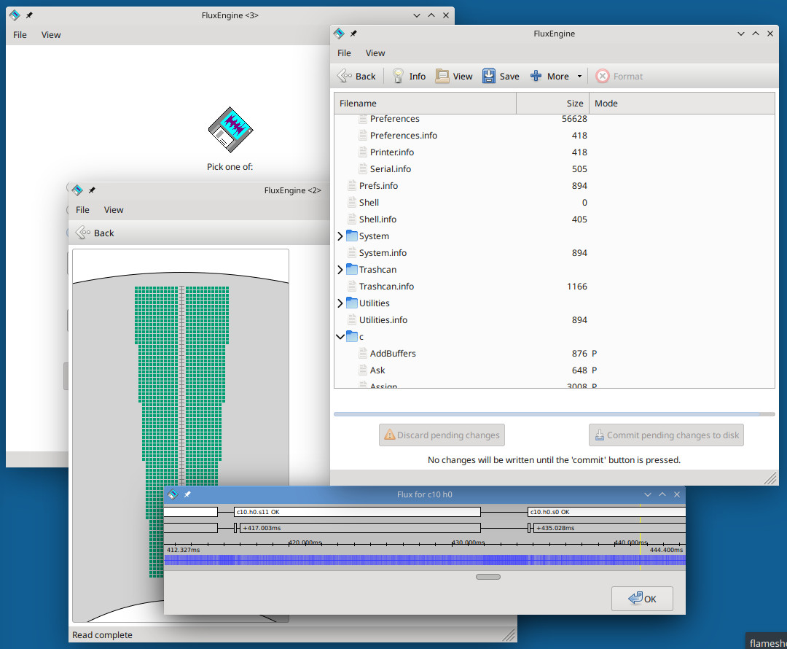

FluxEngine
==========

(If you're reading this on GitHub, the formatting's a bit messed up. [Try the
version on cowlark.com instead.](http://cowlark.com/fluxengine/))

**Breaking news!** As of 2024-10-01, the FluxEngine client software works
(to a point) with [Applesauce](doc/applesauce.md) hardware.

What?
-----

The FluxEngine is a very cheap USB floppy disk interface capable of reading and
writing exotic non-PC floppy disk formats. It allows you to use a conventional
PC drive to accept Amiga disks, CLV Macintosh disks, bizarre 128-sector CP/M
disks, and other weird and bizarre formats. (Although not all of these are
supported yet. I could really use samples.)

The hardware consists of a single, commodity part with a floppy drive
connector soldered onto it. No ordering custom boards, no fiddly surface
mount assembly, and no fuss: nineteen simpler solder joints and you're done.
You can make one for $15 (plus shipping).

Don't believe me? Watch the demo reel!

<iframe width="373" height="210" src="https://www.youtube.com/embed/m_s1iw8eW7o" frameborder="0" allow="accelerometer; autoplay; encrypted-media; gyroscope; picture-in-picture" allowfullscreen></iframe>

**New!** The FluxEngine client software now works with
[Greaseweazle](https://github.com/keirf/Greaseweazle/wiki) and
[Applesauce](https://applesaucefdc.com/) hardware. So, if you can't find a PSoC5
development kit, or don't want to use the Cypress Windows tools for programming
it, you can use one of these instead. Very nearly all FluxEngine features are
available with the Greaseweazle and it works out-of-the box; the Applesauce is a
bit less supported but still works. See the [dedicated Greaseweazle
documentation page](doc/greaseweazle.md) or the [Applesauce
page](doc/applesauce.md) for more information.

Where?
------

It's [open source on GitHub!](https://github.com/davidgiven/fluxengine)

How?
----

This page was getting kinda unwieldy so I've broken it up. Please consult the
following friendly articles:

  - [Frequently asked questions](doc/faq.md) ∾ but why...? ∾ does it...? ∾ can it...?
  
  - [How the FluxEngine works](doc/technical.md) ∾ nitty gritty of the
    sampler/sequencer hardware ∾ useful links on floppy drives ∾ why I'm not
    using an Arduino/STM32/ESP32/Raspberry Pi

  - [Making a FluxEngine](doc/building.md) ∾ what parts you need ∾ building it ∾
    setting up the toolchain ∾ compiling the firmware ∾ programming the board

  - [Using a FluxEngine](doc/using.md) ∾ what to do with your new hardware ∾
    flux files and image files ∾ knowing what you're doing

  - [Using Greaseweazle hardware with the FluxEngine client
    software](doc/greaseweazle.md) ∾ what works ∾ what doesn't work ∾ where to
    go for help

  - [Configuring for your drive](doc/drives.md) ∾ but I don't have a 80 track
    drive! ∾ reading and writing 40 track disks ∾ Shugart and Apple II

  - [Direct filesystem access](doc/filesystem.md) ∾ imaging files is a pain
    ∾ accessing files directly ∾ features and limitation ∾ it works on disk
    images too, you say?
    
  - [Troubleshooting dubious disks](doc/problems.md) ∾ it's not an exact
    science ∾ the sector map ∾ clock detection and the histogram

  - [Disk densities](doc/driveresponse.md) ∾ what's the difference between an HD
    and DD disk? ∾ you can't do that with that ∾ measuring your drive's ability to
    work with exotic formats ∾ I think my drive is broken

Which?
------

The current support state is as follows.

Dinosaurs (🦖) have yet to be observed in real life --- I've written the encoder
and/or decoder based on Kryoflux (or other) dumps I've found. I don't (yet) have
real, physical disks in my hand to test the capture process, or hardware to
verify that written disks work.

Unicorns (🦄) are completely real --- this means that I've read actual, physical
disks with these formats and/or written real, physical disks and then used them
on real hardware, and so know they work (or had reports from people who've had
it work).

If a filesystem is listed, this means that FluxEngine natively supports that
particular filesystem and can read (and sometimes write, support varies) files
directly from disks, flux files or disk images. Some formats have multiple
choices because they can store multiple types of file system.

<!-- FORMATSSTART -->
<!-- This section is automatically generated. Do not edit. -->

| Profile | Format | Read? | Write? | Filesystem? |
|:--------|:-------|:-----:|:------:|:------------|
| [`acornadfs`](doc/disk-acornadfs.md) | Acorn ADFS: BBC Micro, Archimedes | 🦖 |  |  |
| [`acorndfs`](doc/disk-acorndfs.md) | Acorn DFS: Acorn Atom, BBC Micro series | 🦄 |  | ACORNDFS  |
| [`aeslanier`](doc/disk-aeslanier.md) | AES Lanier "No Problem": 616kB 5.25" 77-track SSDD hard sectored | 🦖 |  |  |
| [`agat`](doc/disk-agat.md) | Agat: 840kB 5.25" 80-track DS | 🦖 | 🦖 |  |
| [`amiga`](doc/disk-amiga.md) | Amiga: 880kB 3.5" DSDD | 🦄 | 🦄 | AMIGAFFS  |
| [`ampro`](doc/disk-ampro.md) | Ampro Little Board: CP/M | 🦖 |  | CPMFS  |
| [`apple2`](doc/disk-apple2.md) | Apple II: Prodos, Appledos, and CP/M | 🦄 | 🦄 | APPLEDOS CPMFS PRODOS  |
| [`atarist`](doc/disk-atarist.md) | Atari ST: Almost PC compatible | 🦄 | 🦄 |  |
| [`bk`](doc/disk-bk.md) | BK: 800kB 5.25"/3.5" 80-track 10-sector DSDD | 🦖 | 🦖 |  |
| [`brother`](doc/disk-brother.md) | Brother word processors: GCR family | 🦄 | 🦄 | BROTHER120 FATFS  |
| [`commodore`](doc/disk-commodore.md) | Commodore: 1541, 1581, 8050 and variations | 🦄 | 🦄 | CBMFS  |
| [`eco1`](doc/disk-eco1.md) | VDS Eco1: CP/M; 1210kB 77-track mixed format DSHD | 🦖 |  | CPMFS  |
| [`epsonpf10`](doc/disk-epsonpf10.md) | Epson PF-10: CP/M; 3.5" 40-track DSDD | 🦖 |  | CPMFS  |
| [`f85`](doc/disk-f85.md) | Durango F85: 461kB 5.25" 77-track SS | 🦖 |  |  |
| [`fb100`](doc/disk-fb100.md) | Brother FB-100: 100kB 3.5" 40-track SSSD | 🦖 |  |  |
| [`hplif`](doc/disk-hplif.md) | Hewlett-Packard LIF: a variety of disk formats used by HP | 🦄 | 🦄 | LIF  |
| [`ibm`](doc/disk-ibm.md) | IBM PC: Generic PC 3.5"/5.25" disks | 🦄 | 🦄 | FATFS  |
| [`icl30`](doc/disk-icl30.md) | ICL Model 30: CP/M; 263kB 35-track DSSD | 🦖 |  | CPMFS  |
| [`mac`](doc/disk-mac.md) | Macintosh: 400kB/800kB 3.5" GCR | 🦄 | 🦄 | MACHFS  |
| [`micropolis`](doc/disk-micropolis.md) | Micropolis: 100tpi MetaFloppy disks | 🦄 | 🦄 |  |
| [`ms2000`](doc/disk-ms2000.md) | : MS2000 Microdisk Development System |  |  | MICRODOS  |
| [`mx`](doc/disk-mx.md) | DVK MX: Soviet-era PDP-11 clone | 🦖 |  |  |
| [`n88basic`](doc/disk-n88basic.md) | N88-BASIC: PC8800/PC98 5.25" 77-track 26-sector DSHD | 🦄 | 🦄 |  |
| [`northstar`](doc/disk-northstar.md) | Northstar: 5.25" hard sectored | 🦄 | 🦄 |  |
| [`psos`](doc/disk-psos.md) | pSOS: 800kB DSDD with PHILE | 🦄 | 🦄 | PHILE  |
| [`rolandd20`](doc/disk-rolandd20.md) | Roland D20: 3.5" electronic synthesiser disks | 🦄 | 🦖 | ROLAND  |
| [`rx50`](doc/disk-rx50.md) | Digital RX50: 400kB 5.25" 80-track 10-sector SSDD | 🦖 | 🦖 |  |
| [`smaky6`](doc/disk-smaky6.md) | Smaky 6: 308kB 5.25" 77-track 16-sector SSDD, hard sectored | 🦖 |  | SMAKY6  |
| [`tartu`](doc/disk-tartu.md) | Tartu: The Palivere and variations | 🦄 | 🦖 | CPMFS  |
| [`tids990`](doc/disk-tids990.md) | Texas Instruments DS990: 1126kB 8" DSSD | 🦖 | 🦖 |  |
| [`tiki`](doc/disk-tiki.md) | Tiki 100: CP/M |  |  | CPMFS  |
| [`victor9k`](doc/disk-victor9k.md) | Victor 9000 / Sirius One: 1224kB 5.25" DSDD GCR | 🦖 | 🦖 |  |
| [`zilogmcz`](doc/disk-zilogmcz.md) | Zilog MCZ: 320kB 8" 77-track SSSD hard-sectored | 🦖 |  | ZDOS  |
{: .datatable }

<!-- FORMATSEND -->

### Notes

  - IBM PC disks are the lowest-common-denominator standard. A number of other
    systems use this format in disguise (the Atari ST, late-era Apple
    machines, Acorn). FluxEngine supports both FM and MFM disks, although you
    have to tell it which one. If you have an unknown disk, try this; you may
    get something. Then [tell me about
    it](https://github.com/davidgiven/fluxengine/issues/new).

  - Not many formats support writing yet. That's because I need actual,
    physical hardware to test with in order to verify it works, and I only
    have a limited selection. (Plus a lot of the write code needs work.)
    There hasn't been a lot of demand for this yet; if you have a pressing
    need to write weird disks, [please
    ask](https://github.com/davidgiven/fluxengine/issues/new). I haven't
    implemented write support for PC disks because they're boring and I'm lazy,
    and also because they vary so much that figuring out how to specify them
    is hard.

If you have samples of weird disks, and want to send them to me --- either
FluxEngine, Kryoflux or Catweasel dumps, or (even better) actually physically
--- I can identify them and add support.

Please note that at this point I am *not interested in copy protected disks*.
It's not out of principle. It's just they'll drive me insane. FluxEngine will
most likely be able to read the data fine, unless they're doing bizarre
things like spiral tracks or partially encoded data, but let's stick with
normal conventionally formatted disks for the time being!

But!
----

That said, I need to post a warning.

<b>********** BIG DISCLAIMERY WARNING WITH ASTERISKS **********</b>

Floppy disks are old, unreliable, and frequently damaged and/or filthy. I
expect you to know what you're doing and be responsible for your own actions.
It's entirely possible for a damaged disk, when read, to scrape the magnetic
coating off the disk and pack it into the drive's disk head, not only
permanently damaging the drive, but also irrecoverably destroying any data on
the disk.

If this happens and you complain to me, I will be sympathetic but
fundamentally unhelpful. Proceed at your own risk.

Remember: **FluxEngine is not a substitute for a real data recovery
service.** Is your data worth money to you? If so, don't try to read it using
an open source project hacked together by some person you've never met on the
internet.

Also, remember to clean your disk heads.

<b>********** END OF WARNING **********</b>

Who?
----

The FluxEngine was designed, built and written by me, David Given. You may
contact me at dg@cowlark.com, or visit my website at http://www.cowlark.com.
There may or may not be anything interesting there.

License
-------

Everything here _except the contents of the `dep` directory_ is © 2022 The
FluxEngine Authors (mostly me, David Given; see the VCS history for the other
people) and is licensed under the MIT open source license. Please see
[COPYING](COPYING) for the full text. The tl;dr is: you can do what you like
with it provided you don't claim you wrote it.

As an exception, `dep/emu` contains parts of the OpenBSD C library
code, maintained by Todd Miller and William A. Rowe (and probably others). It is licensed
under the terms of the 3-clause BSD license. Please see the contents of the
directory for the full text. It's been lightly modified by me.

As an exception, `dep/agg` contains parts of the Anti-Grain Antialiasing
library, written by Maxim Semanarev (and others). It is licensed under the
terms of the 3-clause BSD license. Please see the contents of the directory for
the full text. It's been lightly modified by me.

As an exception, `dep/stb` contains parts of the libstb utility library,
written by Sean T Barett (and others). It is public domain/Unlicense/MIT
licensed, at your choice. Please see the contents of the directory for the full
text.

As an exception, `dep/snowhouse` contains the snowhouse assertion library,
taken from https://github.com/banditcpp/snowhouse. It is Boost Standard License
1.0 licensed. Please see the contents of the directory for the full text. Note
that this is only used during the build and no code ends up in the output
binaries.

As an exception, `dep/libusbp` contains the libusbp library, taken from
https://github.com/pololu/libusbp. It is MIT licensed. Please see the contents
of the directory for the full text.

As an exception, `dep/fatfs` contains the fatfs library, taken from
http://elm-chan.org/fsw/ff/00index_e.html. It is single-clause BSD licensed.
Please see the contents of the directory for the full text.

As an exception, `dep/adflib` contains the adflib library, written by Laurent
Clevy et al, taken from https://github.com/lclevy/ADFlib. It is GPL 2.0
licensed. Please see the contents of the directory for the full text.

As an exception, `dep/hfsutils` contains a partial copy of the hfsutils
package, written by Robert Leslie et al, taken from
https://www.mars.org/home/rob/proj/hfs. It is GPL 2.0 licensed. Please see the
contents of the directory for the full text.

__Important:__ Because of all these exceptions, if you distribute the
FluxEngine package as a whole, you must comply with the terms of _all_ of the
licensing terms. This means that __effectively the FluxEngine package is
distributable under the terms of the GPL 2.0__.
