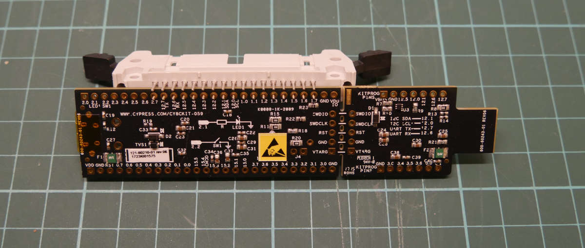
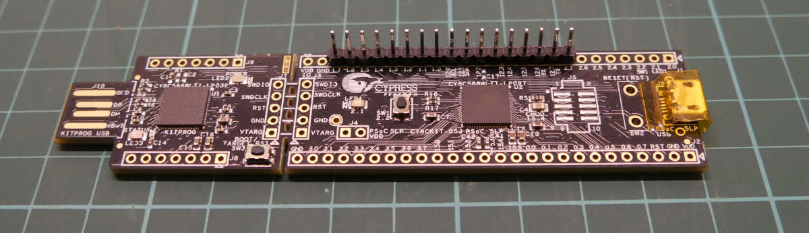
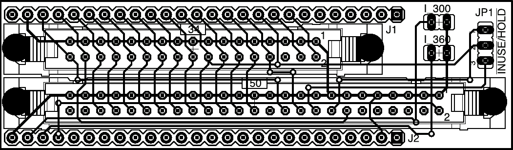

Building the hardware
=====================

This page documents what you need to do to actually build one. Do not fear, I
know several people with mediocre soldering skills who've done it (I count
myself as one of those).

## Bill of materials

This is the physical stuff you'll need.

  - One or more floppy disk drives. Both 3.5" and 5.25" work. One FluxEngine
    will even run both drives (but not at the same time, obviously). You'll
    also need the appropriate cabling to plug the drives into a PC.

  - A [Cypress PSoC5LP CY8CKIT-059 development
    board](http://www.cypress.com/documentation/development-kitsboards/cy8ckit-059-psoc-5lp-prototyping-kit-onboard-programmer-and),
    which is a decently fast ARM core wrapped around a CLDC/FPGA soft logic
    device. You can get one directly from Cypress via the link above for $10,
    but shipping can be extortionate depending where you are. You can also
    find them on eBay or Amazon for about $20.

  - **Either** a 17-way header pin strip **or** [a
    34-way IDC motherboard
    connector](https://eu.mouser.com/ProductDetail/Amphenol-FCI/86130342114345E1LF?qs=%2Fha2pyFadug%252BpMTyxmFhglPPVKuWXYuFpPNgq%252BsrzhDnXxo8B28k7UCGc7F%2FXjsi)
    (or one of the other myriad compatible connectors; there's a billion).

  - A floppy drive cable, preferably one with two connectors and a twist.

  - A suitable power supply. 3.5" floppy drives use 5V at about an amp
    (usually less) --- sadly, too much to power from USB. 5.25" floppy drives
    also require 12V. An old but decent quality PC power supply is ideal, as
    it'll frequently come with the right connectors.

  - a Windows machine to run the Cypress SDK on. (The FluxEngine client
    software itself will run on Linux, Windows, and OSX, but you
    have to build the firmware on Windows.)

  - Basic soldering ability.

  - (Optional) Some kind of box to put it in. I found an old twin 5.25"
	Hewlett Packard drive enclosure and ripped all the SCSI guts out; this not
	only provides a good, solid box to house both my 3.5" and 5.25" drives in,
	but also contains an ideal power supply too. Bonus!


## Assembly instructions

All you need to do is attach your chosen connector to the board. You'll need
to make sure that pin 2 on the cable is connected to pin 2.7 on the board,
and pin 34 to pin 1.7 on the board (and of course all the ones in between).
Apart from grounding the board (see below), this is literally all there is to
it. The actual pinout is described in detail below.

The pads are small, but soldering them isn't too bad with a needle-nosed
soldering iron tip.

### If you're using a connector

Line it up like this.

<div style="text-align: center">
<a href="closeup1.jpg"></a>
</div>

Note the following:

  - You're looking at the back of the board (the side without the big square
    chips). The connector sticks out of the front.

  - The notch on the connector goes at the top.

  - The top row of pins on the connector overhang the edge of the board: they remain unconnected.

Also, be aware that some floppy disk cables don't have a projection on the
motherboard end to fit into that notch, and so will plug in either way round.
That's fine, but some of these get round this by missing a hole for pin 5.
That way they'll only plug into the connector one way round, because the
connector is missing a pin. If you have one of these cables (I do), you'll
need to use a pair of needle-nosed pliers to pull pin 5 out of the connector.

### If you're using header pins

Line it up like this.

<div style="text-align: center">
<a href="closeup2.jpg"></a>
</div>

You're now looking at the _top_ of the board.

(It's also possible to put the pins on the bottom of the board, or to use a
row of header sockets allowing you to plug the board directly onto the floppy
disk drive; for simplicity I'm leaving that as an exercise for the reader.)

### If you want to use a PCB

Alternatively, you can make an actual PCB!

<div style="text-align: center">
<a href="pcb.png"></a>
</div>

This is a passive breakout board designed to take a PSoC5 development board, a
standard 34-way PC connector, and a 50-way 8" drive connector. It was
contributed by a user --- thanks!

<a href="FluxEngine_eagle_pcb.zip">Download this to get it</a>. This package
contains the layout in Eagle format, a printable PDF of the PCB layout, and
gerbers suitable for sending off for manufacture.

### Grounding

You _also_ need to solder a wire between a handy GND pin on the board and
connect it to ground on the drive. Because the board is powered by USB and
the drive by your external power supply, they can be at different potentials,
and they need to be tied together.

If you're using a connector, the simplest thing to do is to bend up one of
the unconnected pins and solder a short piece of wire to a GND pin on the
board. Alternatively you'll need to splice it into your drive's power supply
cable somehow. (The black one.)

## Programming the board

You've got two options here. You can either use the precompiled firmware
supplied with the source, or else install the Cypress SDK and build it
yourself. If you want to hack the firmware source you need the latter, but
if you trust me to do it for you use the precompiled firmware. In either
case you'll need Windows and have to install some Cypress stuff.

**Before you read this:** If you're on Windows, good news! You can download a
precompiled version of the FluxEngine client and precompiled firmware [from
the GitHub releases
page](https://github.com/davidgiven/fluxengine/releases/latest). Simply unzip
it somewhere and run the `.exe` files from a `cmd` window (or other shell).
Follow the instructions below to program the board with the firmware.

### Using the precompiled firmware

On your Windows machine, [install the PSoC
Programmer](https://www.cypress.com/products/psoc-programming-solutions).
**Note:** _not_ the Cypress Programmer, which is for a different board!
Cypress will make you register.

Once done, run it. Plug the blunt end of the FluxEngine board into a USB port
(the end which is a USB plug, with exposed traces; this is on the smaller
section of the board). The programmer should detect it and report it as a
KitProg. You may be prompted to upgrade the programmer hardware; if so, follow
the instructions and do it.

Now go to File -> File Load and open
`FluxEngine.cydsn/CortexM3/ARM_GCC_541/Release/FluxEngine.hex` in the
project. If you're on Windows, the precompiled zipfile also contains a copy
of this file. Press the Program button (the one in the toolbar marked with a
down arrow). Stuff will happen and you should be left with three green boxes
in the status bar and 'Programming Succeeded' at the top of the log window.

You're done. You can unplug the board and close the programmer.

### Building the firmware yourself

On your Windows machine, [install the Cypress SDK and CY8CKIT-059
BSP](http://www.cypress.com/documentation/development-kitsboards/cy8ckit-059-psoc-5lp-prototyping-kit-onboard-programmer-and).
This is a frustratingly long process and there are a lot of moving parts; you
need to register. You want the file from the above site marked 'Download
CY8CKIT-059 Kit Setup (Kit Design Files, Creator, Programmer, Documentation,
Examples)'. I'm not linking to it in case the URL changes when they update
it.

Once this is done, I'd strongly recommend working through the initial tutorial
and making the LED on your board flash. It'll tell you where all the controls
are and how to program the board. Remember that you have to plug the
programming connector into your computer to flash it; the microusb socket is
used only for application control.

When you're ready, open the `FluxEngine.cydsn/FluxEngine.cyprj` project,
pick 'Program' from the menu, and the firmware should compile and be
programmed onto your board.

**Note:** If programming doesn't work and you get a strange dialogue
box asking about port acquisition, then this is because the device isn't
responding to the programmer. This is normal but annoying. You should see the
device in the dialogue. Select it and press the 'Port Acquire' button. The
device should reset and an extra item will appear in the dialogue; select
this and press OK.

If acquiring the port doesn't work, resulting in the IDE hanging for 45
seconds and then producing a meaningless error message, you need to reset the
programmer (the little board hanging off the side of the bigger board).
You'll see that the light on the programmer is pulsing slowly in a breathing
pattern. Press and hold the little button near the light for five seconds
until the light stays solidly on. Now you should be able to acquire
the port and proceed normally.


## Building the client

The client software is where the intelligence, such as it is, is. It's pretty
generic libusb stuff and should build and run on Windows, Linux and OSX as
well, although on Windows it'll need MSYS2 and mingw32. You'll need to
install some support packages.

  - For Linux with Ubuntu/Debian:
	`libusb-1.0-0-dev`, `libsqlite3-dev`, `zlib1g-dev`,
	`libudev-dev`, `protobuf-compiler`, `libwxgtk3.0-gtk3-dev`,
	`libfmt-dev`, `python3`.
  - For Linux with Fedora/Red Hat:
    `git`, `make`, `gcc`, `gcc-c++`, `xxd`, `protobuf-compiler`,
    `protobuf-devel`, `fmt-devel`, `systemd-devel`, `wxGTK3-devel`,
    `libsqlite3x-devel`
  - For OSX with Homebrew: `libusb`, `pkg-config`, `sqlite`,
    `protobuf`, `truncate`, `wxwidgets`, `fmt`.
  - For Windows with MSYS2: `make`, `mingw-w64-i686-libusb`,
	`mingw-w64-i686-protobuf`, `mingw-w64-i686-sqlite3`, `mingw-w64-i686-zlib`,
	`mingw-w64-i686-gcc`, `vim`, `diffutils`, `mingw-w64-i686-wxWidgets`,
	`mingw-w64-i686-fmt`, `mingw-w64-i686-pkg-config`, `mingw-w64-i686-python`.

These lists are not necessarily exhaustive --- please [get in
touch](https://github.com/davidgiven/fluxengine/issues/new) if I've missed
anything.

Windows and Linux (and other Unixes) build by just doing `make`. OSX builds by
doing `gmake` (we're using a feature which the elderly default make in OSX
doesn't have). Remember to add an appropriate `-j` option for a parallel build.
You should end up with some executables in the current directory, one of which
is called `fluxengine` or `fluxengine.exe` depending on your platform. It has
minimal dependencies and you should be able to put it anywhere. The other
binaries may also be of interest.

Potential issues:

  - Complaints about a missing `libudev` on Windows? Make sure you're using the
  mingw Python rather than the msys Python.

If it doesn't build, please [get in
touch](https://github.com/davidgiven/fluxengine/issues/new).


## Connecting it up

You should now have a working board, so it's time to test it.

  1. Plug the motherboard end of your floppy disk cable into the FluxEngine.
     
     The **red stripe goes on the right**. The **lower set of
     holes connect to the board**. See the pinout below.

     If you're using header pins, the upper row of holes in the connector
     should overhang the edge of the board. If you're using a floppy drive
     motherboard connector, you're golden, of course (unless you have one of
     those annoying unkeyed cables, or have accidentally soldered the
     connector on in the wrong place --- don't laugh, I've done it.)

  2. Plug the drive end of your floppy disk cable into the drive (or drives).

     Floppy disk cables typically have [two pairs of floppy disk drive
     connectors with a twist between
     them](http://www.nullmodem.com/Floppy.htm). (Each pair has one connector
     for a 3.5" drive and a different one for a 5.25" drive.) (Some cables
     are cheap and just have the 3.5" connectors. Some are _very_ cheap and
     have a single 3.5" connector, after the twist.)
     
     If you have **two** drives, plug them into both connectors. FluxEngine,
     sadly, uses non-standard disk numbering (there are reasons). Drive 0 is the
     one nearest the motherboard; that is, before the twist. Drive 1 is the
     one at the end of the cable; that is, after the twist. Drive 0 is the
     default. You can tell the client to select drive 1 by using `-s :d=1`.

     If you have **one** drive, you may plug it into _either_ connector.
     FluxEngine will autodetect it and treat it as drive 0. However, you'll
     get the most reliable electrical signal if you plug it in at the end of
     the cable.

     **A note on termination:** some 5.25" drives require jumper configuration
     to tell them whether they're at the end of the cable or in the middle of
     the cable. 3.5" drives don't, and my 5.25" drives don't, so I can't
     advise there. Consult your drive datasheet for details.

  3. **Important.** Make sure that no disk you care about is in the drive.
	 (Because if your wiring is wrong and a disk is inserted, you'll corrupt
	 it.)

  4. Connect the floppy drive to power. Nothing should happen. If you've
	 connected something in backwards, you'll see the drive light up, the motor
	 start, and if you didn't take the disk out, one track has just been wiped.
	 If this happens, check your wiring.

  5. Strip off the little piece of protective plastic on the USB socket on the
	 board --- the little socket at the end, not the big programmer plug.

  6. Connect the FluxEngine to your PC via USB.

  7. Insert a scratch disk and do `fluxengine rpm` from the shell. The motor
     should work and it'll tell you that the disk is spinning at about 300
     rpm for a 3.5" disk, or 360 rpm for a 5.25" disk. If it doesn't, please
     [get in touch](https://github.com/davidgiven/fluxengine/issues/new).

  8. Do `fluxengine test bandwidth` from the shell. It'll measure your USB
	 bandwidth. Ideally you should be getting above 800kB/s in both directions.
	 FluxEngine needs about 300kB/s for a DD disk and about 600kB/s for a HD
	 disk, so if you're getting less than this, try a different USB port.

  9. Insert a standard PC formatted floppy disk into the drive (probably a good
     idea to remove the old disk first). Then do `fluxengine read ibm`. It
     should read the disk, emitting copious diagnostics, and spit out an
     `ibm.img` file containing the decoded disk image (either 1440kB or 720kB
     depending).

 10. Profit!

## Technical details

The board pinout and the way it's connected to the floppy bus is described
below.

```ditaa
:-E -s 0.75
                 +-----+
                 |||||||
            +----+-----+----+
            +cAAA           +
            +  Debug board  +
            +----+-----+----+
            + GND|cDDD | VDD+  
            +----+     +----+
INDEX300 ---+ 3.0|     | GND+--------------------------+
            +----+     +----+                 +--+--+  |
INDEX360 ---+ 3.1|     | 1.7+------ DISKCHG --+34+33+--+
            +----+     +----+                 +--+--+
    TK43 ---+ 3.2|     | 1.6+------- SIDE1 ---+32+31+
            +----+     +----+                 +--+--+
            + 3.3|     | 1.5+------- RDATA ---+30+29+
            +----+     +----+                 +--+--+
            + 3.4|     | 1.4+-------- WPT ----+28+27+
            +----+     +----+                 +--+--+
            + 3.5|     | 1.3+------- TRK00 ---+26+25+
            +----+     +----+                 +--+--+
            + 3.6|     | 1.2+------- WGATE ---+24+23+
            +----+     +----+                 +--+--+
            + 3.7|     | 1.1+------- WDATA ---+22+21+
            +----+     +----+                 +--+--+
            +15.0|     | 1.0+------- STEP ----+20+19+
            +----+     +----+                 +--+--+
            +15.1|     |12.0+--- DIR/SIDE1 ---+18+17+
            +----+     +----+                 +--+--+
            +15.2|     |12.1+------- MOTEB ---+16+15+
            +----+     +----+                 +--+--+
            +15.3|     |12.2+------- DRVSA ---+14+13+
            +----+     +----+                 +--+--+
            +15.4|     |12.3+------- DRVSB ---+12+11+
            +----+     +----+                 +--+--+
            +15.5|     |12.4+------- MOTEA ---+10+9 +
            +----+     +----+                 +--+--+
            + 0.0|     |12.5+------- INDEX ---+8 +7 +
            +----+     +----+                 +--+--+
            + 0.1|     |12.6+-------- n/c ----+6 +5 +
            +----+     +----+                 +--+--+
            + 0.2|     |12.7+- TX --- n/c ----+4 +3 +
            +----+     +----+                 +--+--+
            + 0.3|     | 2.7+------- REDWC ---+2 +1 +
            +----+     +----+                 +--+--+
            + 0.4|     | 2.6+  
            +----+     +----+                FDD socket
            + 0.5|     | 2.5+  
            +----+     +----+
            + 0.6|     | 2.4+    TX: debug UART from board
            +----+     +----+
            + 0.7|     | 2.3+
            +----+     +----+
            + RST|     | 2.2+  
            +----+     +----+
            + GND|     | 2.1+  
            +----+ USB +----+
            + VDD+-----+ 2.0+  
            +----+-----+----+
               PSoC5 board
```

Notes:

  - `DIR/SIDE1` is the step direction pin. During reads or writes, `SIDE1` is
  also multiplexed onto it, because some drives expect this. This is harmless
  on other drives because the `DIR` pin is ignored during reads or writes.

  - `TX` is the debug UART port. It's on pin 12.7 because the board routes it
  to the USB serial port on the programmer, so you can get debug information
  from the FluxEngine by just plugging the programming end into a USB port
  and using a serial terminal at 115200 baud. If you solder a floppy drive
  connector on, then it'll end up connected to pin 4 of the floppy drive bus,
  which is usually not connected. It's possible that some floppy drives do,
  in fact, use this pin. You may wish to remove pin 4 from the floppy drive
  socket before attaching it to the FluxEngine to make sure that this pin is
  not connected; however, so far I have not found any drives for which this
  is necessary. If you do find one, _please_ [get in
  touch](https://github.com/davidgiven/fluxengine/issues/new) so I can
  document it.

  - The `GND` pin only really needs to be connected to one of the floppy bus
  ground pins; pin 33 is the closest. For extra safety, you can bridge all
  the odd numbered pins together and ground them all if you like.

  - `INDEX300` and `INDEX360` are optional output pins which generate fake
  timing pulses for 300 and 360 RPM drives. These are useful for certain
  rather exotic things. See the section on flippy disks [in the FAQ](faq.md)
  for more details; you can normally ignore these.

  - `TK43` is an optional output pin which goes low when the drive is seeking
  to track 43 or above. This is useful when using 8" floppy drives, which
  require reduced write current when writing to these tracks.

## Next steps

You should now be ready to go. You'll want to read [the client
documentation](using.md) for information about how to actually do interesting
things.

I _do_ make updates to the firmware whenever necessary, so you may need to
reprogram it at intervals; you may want to take this into account if you
build a case for it. I have a USB extension cable plugged onto the programmer
port, which trails out the side of my drive enclosure. This works fine.
