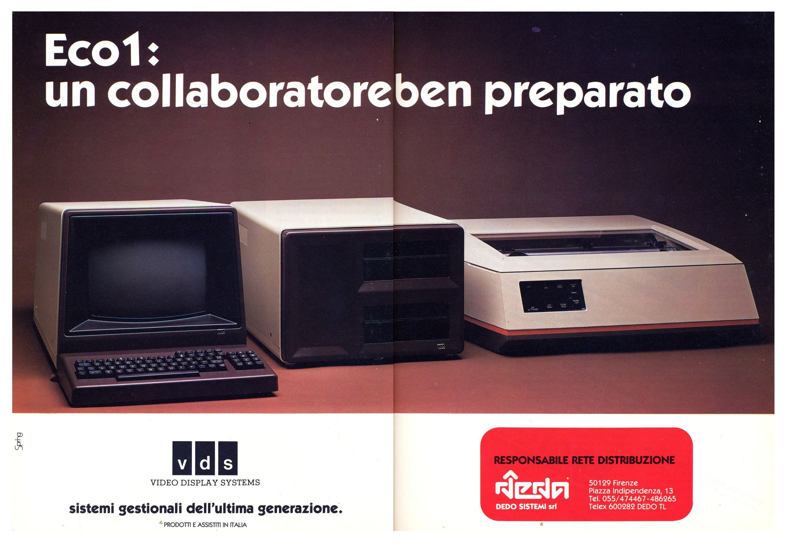

eco1
====
## CP/M; 1210kB 77-track mixed format DSHD
<!-- This file is automatically generated. Do not edit. -->

The Eco1 is a Italian CP/M machine produced in 1982. It had 64kB of RAM, in
later models expandable up to 384kB, and _two_ Z80 processors. One of these was
used solely for managing the twin 8" drives, each storing 1.2MB, which was
quite impressive for a CP/M machine in those days. Visually it is best
described as 'very brown'.

Its format is standard IBM scheme, but with an interesting wrinkle: there are
_three_ different formatting zones on the disk:

  - Track 0 side 0: 26 sectors, 128 bytes per sector (3296 bytes)
  - Track 0 side 1: 26 sectors, 256 bytes per sector (6656 bytes)
  - All others: 16 sectors, 512 bytes per sector (8192 bytes)

The standard `read ibm` command will autodetect and read these disks, but due
to the format confusing the size autodetection the images need postprocessing
to be useful, so there's a custom profile for the Eco1 which produces sensible
images.

## Options

(no options)

## Examples

To read:

  - `fluxengine read eco1 -s drive:0 -o eco1.img`

## References

  - [Apulio Retrocomputing's page on the
	Eco1](https://www.apuliaretrocomputing.it/wordpress/?p=8976)

