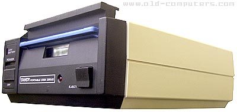

fb100
====
## 100kB 3.5" 40-track SSSD
<!-- This file is automatically generated. Do not edit. -->

The Brother FB-100 is a serial-attached smart floppy drive used by a several
different machines for mass storage, including the Tandy Model 100 and
clones, the Husky Hunter 2, and (bizarrely) several knitting machines. It was
usually rebadged, sometimes with a cheap paper label stuck over the Brother
logo, but the most common variant appears to be the Tandy Portable Disk Drive
or TPDD:

It's a bit of an oddball: the disk encoding is FM with a very custom record
scheme: 40-track single-sided 3.5" disks storing 100kB or so each. Each track
had only _two_ sectors, each 1280 bytes, but with an additional 12 bytes of
ID data used for filesystem management.

There was also apparently a TPDD-2 which could store twice as much data, but
I don't have access to one of those disks.

## Options

(no options)

## Examples

To read:

  - `fluxengine read fb100 -s drive:0 -o fb100.img`

## References

  - [Tandy Portable Disk Drive operations
	manual](http://www.classiccmp.org/cini/pdf/Tandy/Portable%20Disk%20Drive%20Operation%20Manual.pdf)

  - [Tandy Portable Disk Drive service
	manual](https://archive.org/details/TandyPortableDiskDriveSoftwareManual26-3808s)

  - [TPDD design notes (including a dump of the
	ROM)](http://bitchin100.com/wiki/index.php?title=TPDD_Design_Notes)

  - [Knitting machine FB-100
	resources](http://www.k2g2.org/wiki:brother_fb-100)

