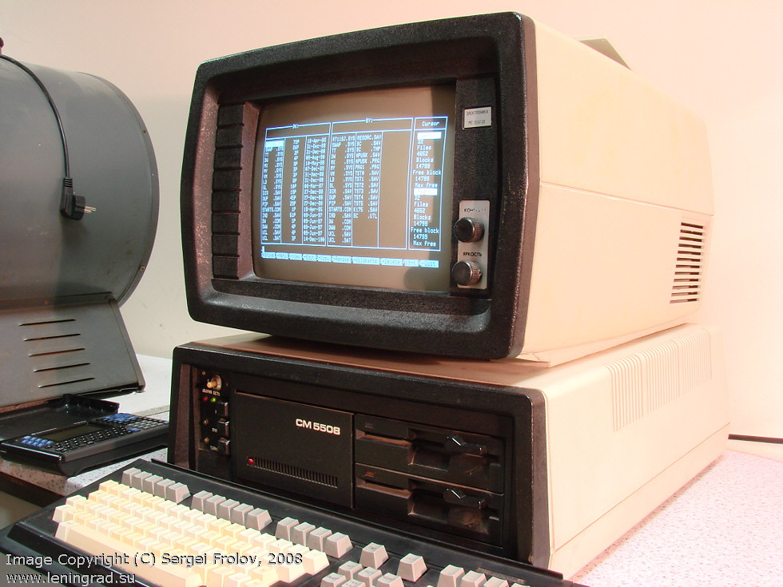

Disk: DVK MX
============

The DVK (in Russian, ДВК, Диалоговый вычислительный комплекс or Dialogue
Computing Complex) was a late 1970s Soviet personal computer, a cut-down
version of the professional SM EVM (СМ ЭВМ, abbreviation of Система Малых ЭВМ
--- literally System of Mini Computers), which _itself_ was an unlicensed
clone of the PDP-11. The MX board was an early floppy drive controller board
for it.

<div style="text-align: center">
<a href="http://www.leningrad.su/museum/show_big.php?n=1006"></a>
</div>

The MX format is interesting in that it has to be read a track at a time. The
format contains the usual ID prologue at the beginning of the track, then
eleven data blocks and checksums, then the epilogue, then it stops. The
actual encoding is normal FM. There were four different disk variants, in all
combinations of single- and double-sided and 40- and 80-tracked; but every
track contained eleven 256-byte sectors.

The format varies subtly depending on whether you're using the 'new' driver
or the 'old' driver. FluxEngine should read both.

A track is:

  * 8 x 0x0000 words (FM encoded as 01010101...)
  * 1 x 0x00F3 --- start of track
  * 1 x 0xnnnn --- track number
  * 11 of:
    * 128 words (256 bytes) of data
    * 16 bit checksum
  * **if 'new' format:**
    * 3 x 0x83nn --- `n = (track_number<<1) + side_number`
  * **if 'old' format:**
    * 3 x 0x8301

The checksum is just the unsigned integer sum of all the words in the sector.
Words are all stored little-endian.

Reading discs
-------------

```
fluxengine read mx
```

You should end up with an `mx.img` which will vary in length depending on the format. The default is double-sided 80-track. For the other formats, use:

  * single-sided 40-track: `-s :s=0:t=0-79x2`
  * double-sided 40-track: `-s :s=0-1:t=0-79x2`
  * single-sided 40-track: `-s :s=0:t=0-79`
  * double-sided 40-track: `-s :s=0-1:t=0-79`


Useful references
-----------------

  - [The Soviet Digital Electronics
    Museum](http://www.leningrad.su/museum/main.php) (source of the image
    above)

  - [a random post on the HxC2001 support
    forum](http://torlus.com/floppy/forum/viewtopic.php?t=1384) with lots of
    information on the format
