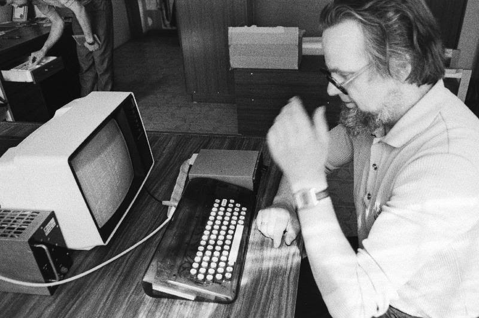
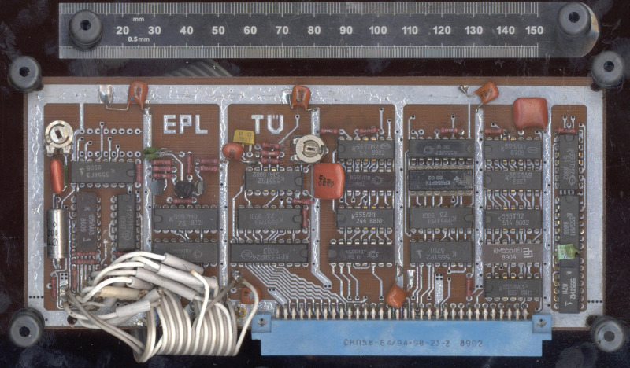

tartu
====
## The Palivere and variations
<!-- This file is automatically generated. Do not edit. -->

The Tartu Palivere is a 1988 Z80-based computer from Estonia. It is a CP/M
machine with 64kB of RAM, running off a 2MHz ꃣ0e30
clone; it operated off punched tape, cassette, external hard drive or floppy, and was notable as being the first ever computer with an Estonian keyboard.

From a floppy disk perspective, it is interesting because the floppy drive
interface is almost entirely handled in software --- necessary at the time as
the usual floppy disk interface chip at the time, the ⎲fba5
of the WD1793), was hard to find. Instead, the floppy controller board was
implemented entirely using TTL logic. Despite this, the encoding is fairly high
density, using MFM and with up to 780kB on a double-sided 80 track disk.

FluxEngine supports reading and writing Tartu disks with CP/M filesystem access.

## Options

  - Format variants:
      - `390`: 390kB 5.25" 40-track DSDD
      - `780`: 780kB 5.25" 80-track DSDD

## Examples

To read:

  - `fluxengine read tartu --390 -s drive:0 -o tartu.img`
  - `fluxengine read tartu --780 -s drive:0 -o tartu.img`

To write:

  - `fluxengine write tartu --390 -d drive:0 -i tartu.img`
  - `fluxengine write tartu --780 -d drive:0 -i tartu.img`

## References

  - [The Estonia Museum of Electronics](https://www.elektroonikamuuseum.ee/tartu_arvuti_lugu.html)

