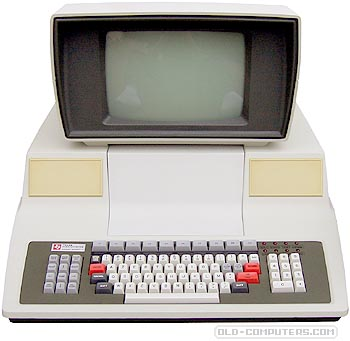

tids990
====
## 1126kB 8" DSSD
<!-- This file is automatically generated. Do not edit. -->

The Texas Instruments DS990 was a multiuser modular computing system from 1998,
based around the TMS-9900 processor (as used by the TI-99). It had an 8" floppy
drive module, the FD1000, which was a 77-track, 288-byte sector FM/MFM system
with 26 sectors per track. The encoding scheme was very similar to a simplified
version of the IBM scheme, but of course not compatible. A double-sided disk
would store a very satisfactory 1126kB of data; here's one at <a
href="https://www.old-computers.com/museum/computer.asp?st=1&c=1025">old-computers.com</a>:

FluxEngine will read and write these (but only the DSDD MFM variant).

## Options

(no options)

## Examples

To read:

  - `fluxengine read tids990 -s drive:0 -o tids990.img`

To write:

  - `fluxengine write tids990 -d drive:0 -i tids990.img`

## References

  - [The FD1000 Depot Maintenance
        Manual](http://www.bitsavers.org/pdf/ti/990/disk/2261885-9701_FD1000depotVo1_Jan81.pdf)

