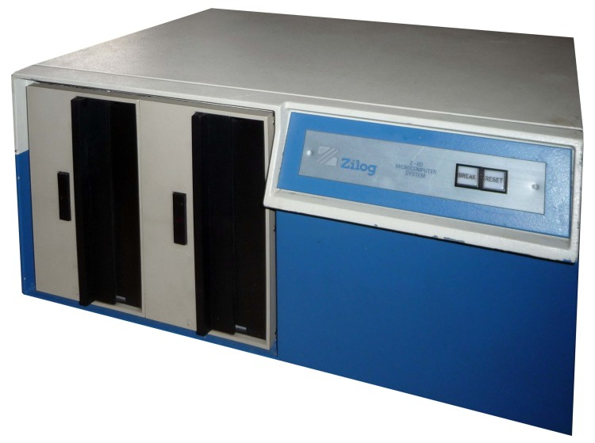

zilogmcz
====
## 320kB 8" 77-track SSSD hard-sectored
<!-- This file is automatically generated. Do not edit. -->

The Zilog MCZ is an extremely early Z80 development system, produced by
Zilog, which came out in 1976. It used twin 8-inch hard sectored floppy
drives; here's one at the <a
href="http://www.computinghistory.org.uk/det/12157/Zilog-Z-80-Microcomputer-System/">Centre
for Computing History</a>:

The MCZ ran Zilog's own operating system, Z80-RIO, and used 77 track
single-sided disks, with 32 sectors (each marked by an index hole), with 132
bytes per sector --- 128 bytes of user payload plus two two-byte metadata
words used to construct linked lists of sectors for storing files. These
stored 320kB each.

FluxEngine has read support for these, including support for RIO's ZDOS file
system.

## Options

(no options)

## Examples

To read:

  - `fluxengine read zilogmcz -s drive:0 -o zilogmcz.img`

## References

  * [About the Zilog MCZ](http://www.retrotechnology.com/restore/zilog.html),
    containing lots of useful links

  * [The hardware user's manual](https://amaus.org/static/S100/zilog/ZDS/Zilog%20ZDS%201-25%20Hardware%20Users%20Manual.pdf)

