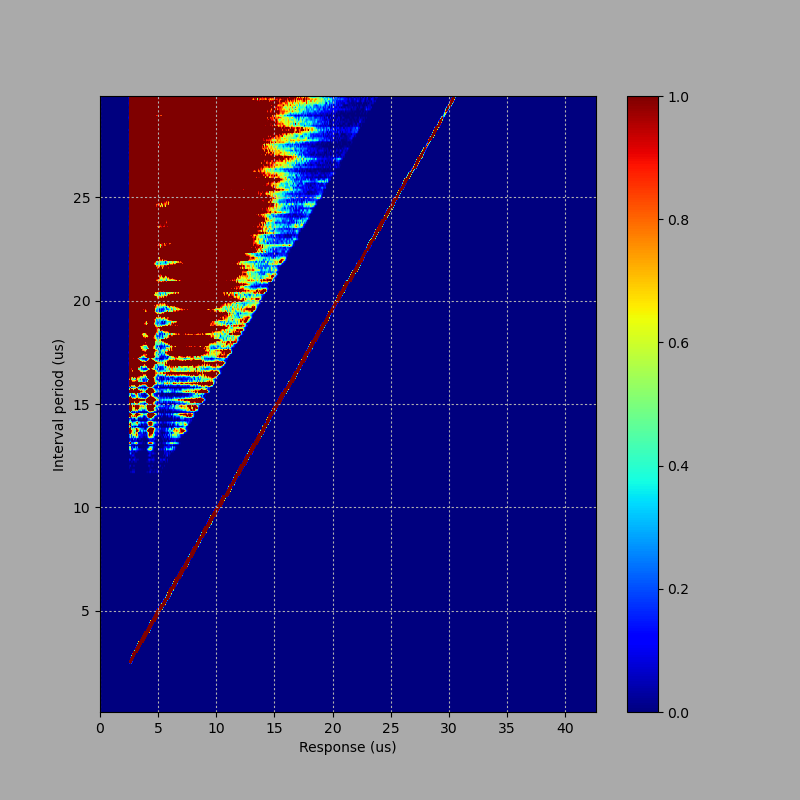
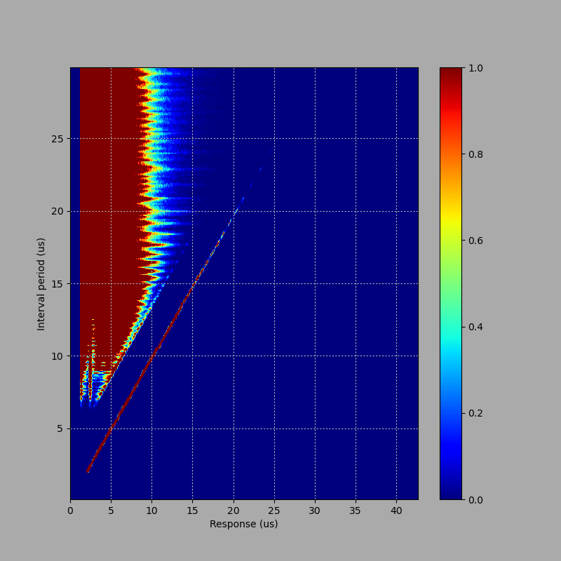

Analysing drive response
========================

Not all PC drives are made equal. Some are less equal than others.

The way floppy disk storage works is that the floppy drive controller will
generate a series of pulses, which the drive stores on the disk. Then, when the
disk is read, the drive will reproduce the same series of pulses and return it
to the floppy drive controller. The data is stored in the intervals between
pulses.

The problem is that some PC drives assume that they're going to be used with
IBM scheme disks, which use particular pulse intervals --- in the case of DD
disks, intervals are always 4us, 6us or 8us. So, in a misguided attempt to
improve reliability, they sometimes... tidy... the incoming pulse stream. This
can have nasty effects if you're not a disk which _doesn't_ use those intervals.

In addition, they won't work properly if the intervals are too great, or too
small. Partly this is a limitation of the underlying physics of the magnetic
media, and partly it's due to the drive's automatic gain adjustment: if the
drive doesn't see a pulse, it'll start ramping up the gain of its amplifier,
until it starts interpreting random noise as a valid pulse.

FluxEngine has a tool to analyse a drive and report on this behaviour. It works
by writing a sequence of timed pulses to the disk, then reading them back and
seeing what the drive actually reports. To use it, do:

```
fluxengine analyse driveresponse -d :d=1:t=0 --min-interval-us=0 --max-interval-us=30 --interval-step-us=.1 --write-csv=driveresponse.csv
python3 scripts/driveresponse.csv
```

This will scan all intervals from 0us to 30us, at 0.1us steps, and write the
result as a CSV file. Then the Python script uses matplotlib to render the
result as a heatmap. They look like this.

<div style="text-align: center">
</a>
</a>
</div>

This is the analysis from the [Sony
MPF-920](https://docs.sony.com/release/MPF920Z.pdf) 3.5" drive I mostly use for
testing. The left-hand image shows the result from a DD disk, while the right
hand image shows the result from a HD disk.

The vertical access is the width of pulse being written; the horizontal axis
and heatmap shows the distribution of pulses being read back. Yoou can see the
diagonal line, which represents correct pulses. The triangular smear in the top
left shows spurious pulses which are being read back because the interval is
too great; these start at about 12us for DD disks and 7us for HD disks. This is
an artifact of the different magnetic media for the two types of disk.

(This, by the way, is why you shouldn't use DD formats on HD disks. The
intervals on a DD disk can go up to 8us, which is on the edge of the ability of
an HD disk and drive to correctly report back the pulses.)

You also note the hard cut-off on the left: this represents the filter on the
drive, which will simply refuse to report pulse intervals shorter than about
1.5us. FluxEngine itself can't write intervals shorter than 2us.

For comparison purposes, here's another set of graphs.

<div style="text-align: center">
</a>
</a>
</div>

This is from another drive I have; it's an unbranded combo
card-reader-and-floppy drive unit; the 90206 is the only identification mark it
has. I don't use this because it's problematic, and the graph shows why; you
can just see some ghosting on the HD graph at at 3us, where some pulses are
coming back reported at 6us. This won't affect IBM scheme disks because they
don't use 3us as an interval, but it might effect other formats. And the DD
graph shows that intervals below about 4us are reported as double what they
should be: so, this drive won't work on [Macintosh 800kB
formats](disk-macintosh.md) at all, because they use intervals starting at
2.6us, below this limit. But it should work on PC formats --- just.

