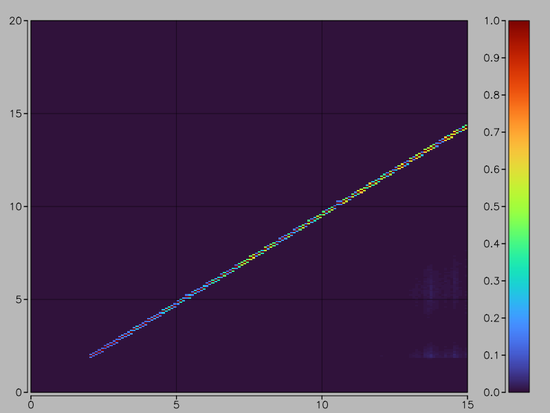
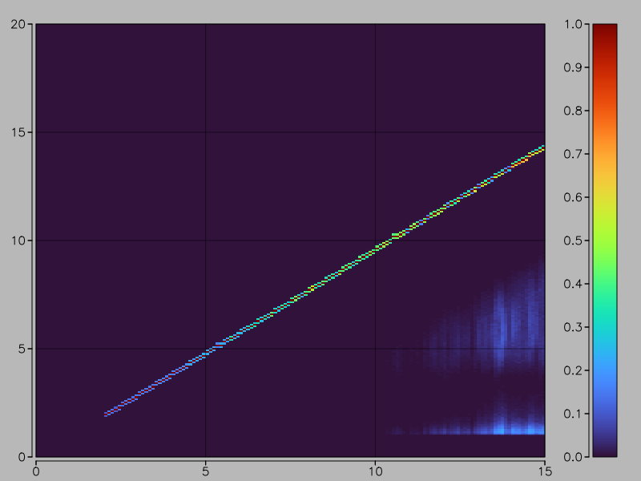
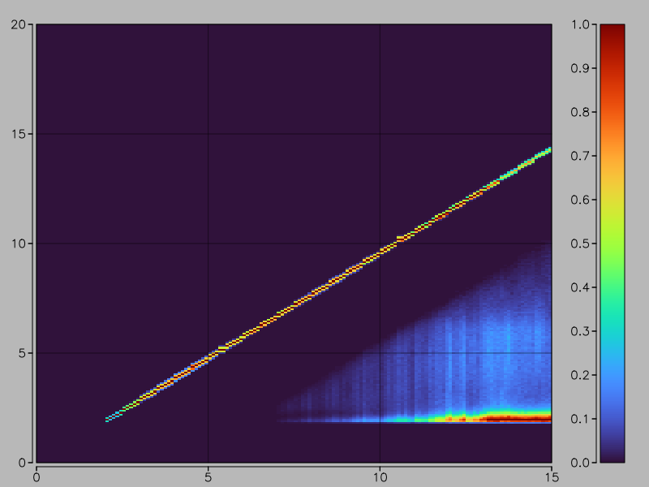
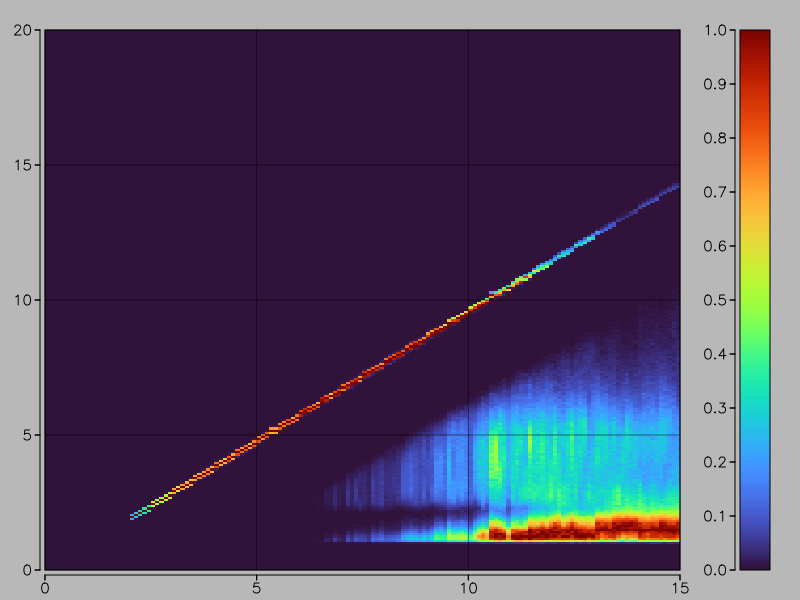
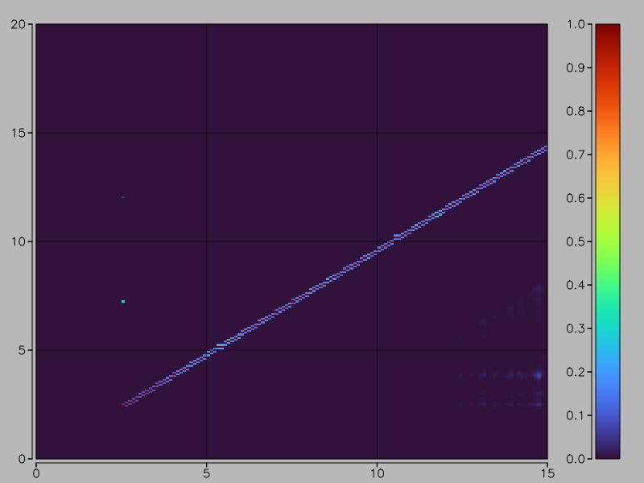
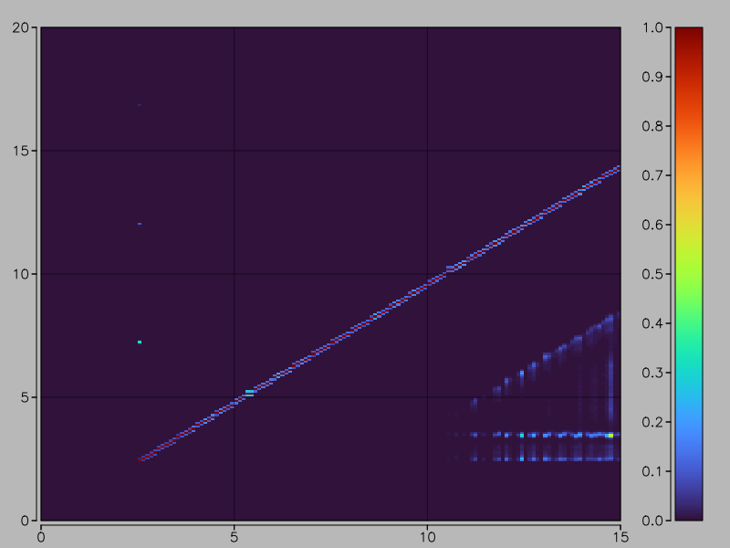
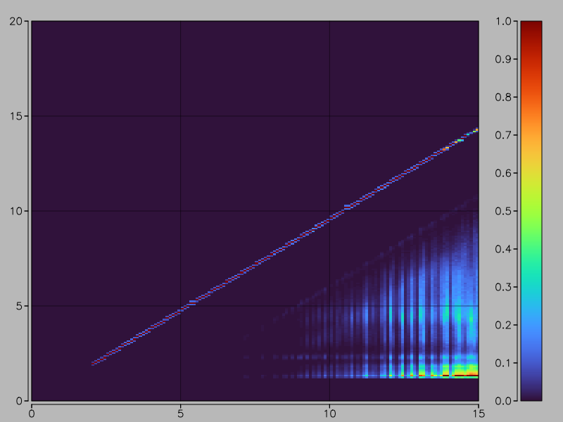
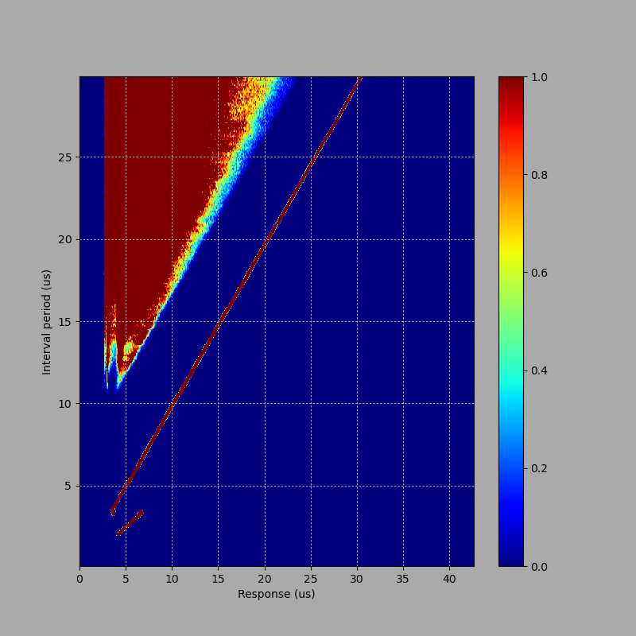
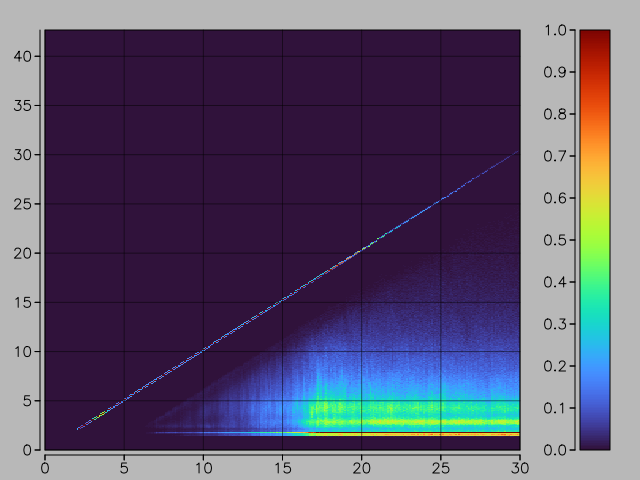

Disk and drive density
======================

**tl;dr:** with 5.25" drives, it is _vitally important_ that you set
`--drive.high_density=0|1` correctly when working with disks.

Not all PC drives are made equal. Some are less equal than others.

The way floppy disk storage works is that the floppy drive controller will
generate a series of pulses, which the drive stores on the disk. Then, when the
disk is read, the drive will reproduce the same series of pulses and return it
to the floppy drive controller. The data is stored by the intervals between
pulses.

However, the underlying physics of the magnetic media put limitations on how far
apart the pulses can be. If they're too close, they will physically move further
apart... and if they're too far apart, the drive will detect spurious pulses
that don't exist in real life (due to the way the drive's automatic gain
adjustment on the head amplifiers work).

So, it's very important what kind of disks you use, and what kind of drives you
put those disks in: these can vary.

Disk densities
--------------

Disks usually come in two varieties: SD/DD/QD disks, and HD disks.  (There's
also ED and TD but they're fairly specialist and FluxEngine doesn't support
them.)

SD (single density), DD (double density) and QD (quad density) actually refer to
the way the data is stored on the disk.  SD usually implies FM, and DD implies
MFM, which allows 60% more data; QD implies MFM _plus_ narrower tracks, doubling
the track count and hence the amount of data.  This distinction was important
back when you had to buy pre-formatted disks, so you needed disks which matched
your drive. FluxEngine, of course, formats them itself.

HD disks use a different magnetic medium, based on cobalt rather than iron
oxide. This allows the pulses on the disk to be much closer together. This
doubles the amount of data yet again. The downside of HD disks is that the
pulses _have_ to be closer together so you're likely to have problems if you try
to write SD/DD/QD formats onto HD disks.

It's also worth noting that 3.5" SD/DD/QD disks are much more like 3.5" HD disks
than 5.25" SD/DD/QD disks are like 5.25" HD disks. If you own an Amiga which
uses 3.5" DD disks, you'll know that HD disks will mostly work just fine in an
Amiga; but if you own a C64 with 5.25" SD disks, you'll know that HD disks are
likely to be error-prone.

Drive types
-----------

Of course, the disk itself is only half the story...

Old floppy disk drives vary in what formats they support. The usual variables are:
disk rotation speed (either 300rpm or 360rpm); number of tracks (either 40 or
80); and whether they can support HD disks. (Plus, of course, whether it's 3.5"
or 5.25", but the technology is largely identical so I'm ignoring that.)

'Modern' drives are pretty consistent in that they run at 300rpm (for a 3.5"
drive) or 360rpm (for a 5.25" drive), have 80 tracks, and support HD.

There are two additional wrinkles:

- the drive must be configured for SS/DD/QD media or HD media. 3.5" drives can
do this automatically, as there's a hole in the disk case which a drive sensor
can detect, but 5.25" drives don't, and must be told what medium is being used
by the computer. (FluxEngine uses the `--drive.high_density=0|1` option for
this.)

- some drives are designed to only support IBM formats, which use pulse widths
of 4µs, 6µs or 8µs, and when given pulses that aren't this wide they behave...
poorly.

Actually measuring things
-------------------------

FluxEngine has a tool to analyse a drive and report on this behaviour. It works
by writing a sequence of timed pulses to the disk, then reading them back and
seeing what the drive actually reports. To use it, do:

```
fluxengine analyse driveresponse --cylinder 0 \
    --min-interval-us=0 --max-interval-us=15 --interval-step-us=.1 \
	--write-img=driveresponse.png
```

This will scan all intervals from 0µs to 15µs, at 0.1µs steps, draw a graph,
and write out the result.

Using mismatched media and drive configuration
----------------------------------------------

There are four possible options when using 5.25" media in my Panasonic JU-475
5.25" drive. The following table shows what the analysis tool shows for all
these options.

(Click to expand)

<div style="text-align: center">
<table class="datatable">
    <tr>
        <th></th>
        <th>DD drive</th>
        <th>HD drive</th>
    </tr>
    <tr>
        <th>DD media</th>
        <td>
            <a href="ju475-dd-lo.png">
                
            </a>
        </td>
        <td>
            <a href="ju475-dd-hi.png">
                
            </a>
        </td>
    </tr>
    <tr>
        <th>HD media</th>
        <td>
            <a href="ju475-hd-lo.png">
                
            </a>
        </td>
        <td>
            <a href="ju475-hd-hi.png">
                
            </a>
        </td>
    </tr>
</table>
</div>

The X axis shows the width of the pulse being sent to the drive. This gets
recorded to the disk (repeatedly). The Y axis shows a heatmap of the pulses read
back again. What we want to see is a solid diagonal line, showing that the
pulses are being read back accurately. However, once the pulse width gets wide
enough, spurious pulses appear, which show up on the graph as the rainbow smear
in the bottom left corner. You can see that this is much more pronounced on the
HD media than it is on the DD media --- the DD media is capable of accurately
reproducing pulses up to about 12µs, while the HD media only goes up to 7µs.

This demonstrates that some formats, such as the [Apple II](doc/disk-apple2.md)
which uses a maximum pulse width of 8µs, cannot be written to HD media at all.

We would also normally see spurious pulses on the left of the graph, indicating
that pulses are too close together to be reproduced accurately, but we're not
--- the Panasonic is a good drive.

For comparison, following is the same table for my Sony MPF-90 3.5" drive.

(Click to expand)

<div style="text-align: center">
<table class="datatable">
    <tr>
        <th></th>
        <th>DD drive</th>
        <th>HD drive</th>
    </tr>
    <tr>
        <th>DD media</th>
        <td>
            <a href="mpf90-dd-lo.png">
                
            </a>
        </td>
        <td>
        </td>
    </tr>
    <tr>
        <th>HD media</th>
        <td>
            <a href="mpf90-hd-lo.png">
                
            </a>
        </td>
        <td>
            <a href="mpf90-hd-hi.png">
                
            </a>
        </td>
    </tr>
</table>
</div>

As 3.5" drives autodetect the media type, I had to tape over the hole in a HD
disk to make the drive treat it as a DD disk. Unfortunately, doing it the other
way around would require drilling a hole in a DD disk, which I'm unwilling to
do! So there are only three graphs here.

We get the same smear of spurious pulses in the bottom left, but we _also_ get
some incorrect pulses on the left. In addition, the line itself only starts at
about 2.5µs --- it turns out that this drive simply returns nothing at all for
pulses shorter than that.

(FluxEngine itself can't write intervals shorter than 2us.)

And, finally, here is one additional pair of graphs.

<div style="text-align: center">
<table class="datatable">
    <tr>
        <th></th>
        <th>DD drive</th>
        <th>HD drive</th>
    </tr>
    <tr>
        <th>DD media</th>
        <td>
            <a href="fdd-90206-dd.png">
                
            </a>
        </td>
        <td>
        </td>
    </tr>
    <tr>
        <th>HD media</th>
        <td></td>
        </td>
        <td>
            <a href="fdd-90206-hd.png">
                
            </a>
        </td>
    </tr>
</table>
</div>

This is from another drive I have; it's an unbranded combo
card-reader-and-3.5"-floppy drive unit; the 90206 is the only identification mark it
has.  The DD graph shows that intervals below about 4µs are reported as double
what they should be: so, this drive won't work on [Macintosh 800kB
formats](disk-macintosh.md) at all, because they use intervals starting at
2.6µs, below this limit. But it should work on PC formats --- just.

