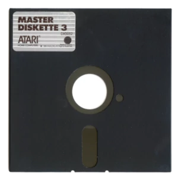

Frequently asked questions
==========================

**Q.** Why not just use a USB floppy drive? There are lots and they're cheap.

**A.** Because USB floppy drives typically support a very limited set of
formats --- typically only IBM 1440kB and 720kB. The FluxEngine should work
on (almost) anything, including the ones that IBM machines won't touch. Also,
as it's USB, it'll work happily on machines that were never designed for
floppy disks (like my development Chromebook).

**Q.** But aren't floppy disks obsolete?

**A.** Absolutely they are. That doesn't mean they've gone away. Good luck
with any old hardware, for example; a classic Mac won't boot without a
classic Mac boot disk, and you can't make them on PCs (because they're
weird). This is where the FluxEngine comes in.

**Q.** But how can you read and write non-PC formats on a PC floppy drive?

**A.** Because the FluxEngine hardware simply streams the raw magnetic flux
pulsetrain from the drive to the PC, and then the analysis is done off-line
in software. It doesn't rely on any floppy disk controller to interpret the
pulsetrain, so we can be a lot cleverer. In fact, the disk doesn't even have
to be spinning at the same speed.

**Q.** Does it work on 5.25" drives?

**A.** Yes! Although PC 5.25" drives spin at 360 RPM rather than 300 RPM,
which means there's only 166ms of data on one per track rather than 200ms;
if you try to write a 3.5" format disk onto one it probably won't work.

**Q.** Does it work on 8" drives?

**A.** Probably? You'd need an adapter to let you connect the drive to the
FluxEngine --- [you can get them](http://www.dbit.com/fdadap.html). I don't
have either the adapter, the drive, or any 8" disks. If anyone wants to give
it a try, please [tell me about
it](https://github.com/davidgiven/fluxengine/issues/new).

**Q.** Does it work on hard sectored disks?

**A.** Probably? I already have decoder support for some hard-sectored disk
formats, based on Kryoflux streams people sent me, and the firmware supports
reporting index hole information, so in theory it _should_ work; but I
haven't had the chance to try it end-for-end. I really need a hard-sectored
5.25" floppy to test with.

**Q.** Does it work with flippy disks?

Uhhh... maybe?

So the problem with flippy disks (5.25" single-sided disks which could be
inserted upside down to read the second side) is the index hole. Trouble is,
the window to let the sensor see the index hole isn't symmetrical on a 5.25"
disk, so if you turn the disk upside down, the drive can't see the hole any
more:

Some flippy disks had two windows, so they'd work properly either way up, but
most didn't. This was fine on a lot of old machines because those drives
didn't have an index hole sensor. But a lot of modern drives use the index
hole to detect whether the disk is actually present and if they don't see it,
they simply won't work. There's nothing FluxEngine can do; it's a hardware
limitation.

(If you have one of the rare disks with two index holes, then FluxEngine
_will_ read those.)

There are workarounds. One is to read the data on the other side of the disk
using the other head --- because, of course, modern drives are double-sided.
Sure, the disk is spinning in the wrong direction, but that's no problem.
Except there _is_ a problem, which is the tracks on the two sides of the disk
are not in the same place; one side has them offset eight tracks compared to
the other. But a flippy disk has both sets of tracks in the same place,
because they're both accessed using the side 0 head...

The only real way round this is to modify a 5.25" drive. That's _seriously_
not in FluxEngine's remit, but I've had some [excellent documentation
contributed](Index_sensor_mod_FDD_1.1.pdf) on how to do this. I've never done
it myself; if you try this and it works/doesn't work, as always, [get in
touch](https://github.com/davidgiven/fluxengine/issues/new).

Another option is to fake the index signal to the drive completely. The
FluxEngine emits suitable pulses for a 300RPM drive on pin 3[0] and the
equivalent pulses for a 360RPM drive on pin 3[1]. Disclaimer: I have never used
these.

**Q.** Is this like Supercard Pro / KryoFlux / Catweasel / DiskFerret? Do you
*support KryoFlux
stream files?

**A.** It's very like all of these; the idea's old, and lots of people have
tried it (you can get away with any sufficiently fast microcontroller and
enough RAM). FluxEngine can read from KryoFlux stream files natively, and
there's a tool which will let you convert at least one kind of Catweasel
files and Supercard Pro files to and from FluxEngine's native flux file
format.

**Q.** Can I use this to make exact copies of disks?

**A.** No. FluxEngine can read disks, and it can write disks, but it can't
write flux files that it read. There's several reasons for this, including
but not limited to: amplification of disk noise causing unreadable disks;
needing to rearrange the read data so it all fits exactly between the index
markers; reproduction of non-repeatable noise (this was a common trick with
Apple II copy protection); etc. What FluxEngine prefers is to read a disk,
turn it into a filesystem image, and then synthesise flux from the filesystem
image and write _that_ to another disk.
