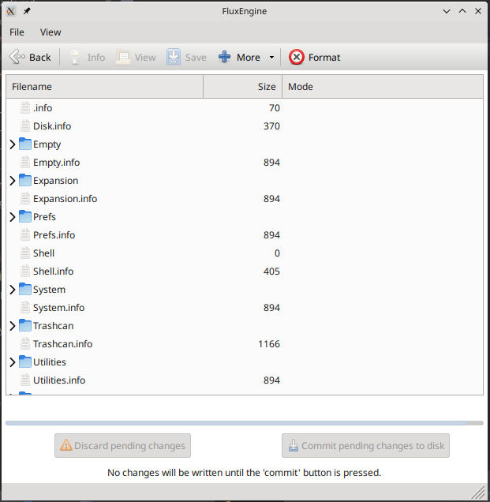

Direct filesystem access
========================

FluxEngine will let you read and write files directly, in many cases. This will
allow you to pull files directly off a disk, or flux image, or disk image,
without needing to image it first. You can also write, and make other
modifications, including formatting blank disks, if the filesystem supports it.
The GUI even has a reasonably competent file manager.

<div style="text-align: center">
<a href="filebrowser.jpg"></a>
</div>

The following file systems are supported so far.

| Filesystem                               | Read? | Write? | Notes |
|:-----------------------------------------|:-----:|:------:|-------|
| Acorn DFS                                |   Y   |        |       |
| Amiga FFS                                |   Y   |   Y    | Both OFS and FFS |
| Brother 120kB                            |   Y   |        |       |
| Commodore CbmFS                          |   Y   |        | Only 1541 disks so far |
| CP/M                                     |   Y   |        | For selected formats |
| FatFS (a.k.a. MS-DOS)                    |   Y   |   Y    | FAT12, FAT16, FAT32, but only SFN; not Atari |
| Macintosh HFS                            |   Y   |   Y    | Only AppleDouble files may be written |
| Apple ProDOS                             |   Y   |        |       |

Please not that Atari disks do _not_ use standard FatFS, and the library I'm
using for the heavy lifting (ChaN's
[FatFS](http://elm-chan.org/fsw/ff/00index_e.html) doesn't seem to support it.
If you know different, please [get in
touch](https://github.com/davidgiven/fluxengine/issues/new).

Using it
--------

To use, try syntax like this:

```
fluxengine ls ibm180 -f drive:0
```

`ibm180` is the format, which selects the most common filesystem automatically.
`-f drive:0` specifies a flux source/sink, in this case a real disk. You may
also specify a flux file (read only). Disk images may be specified with `-i
disk.img` (read/write).

Commands which take filename paramaters typically use `-p` to indicate the path
on the disk, and `-l` for the local filename. For example:

```
fluxengine putfile ibm180 -f drive:0 -p ondisk.pcx -l z.pcx
```

This will copy the file `z.pcx` onto the disk and call it `ONDISK.PCX`.

The directory separator character is _always_ `/`, even if you're using
Macintosh HFS, where it's usually `:`.

The command line interface is pretty clunky, and is intended for scripts. For
everyday use, I'd suggest using the GUI (see the screenshot above).

The supported commands are:

  - **ls**: list files (including in a directory)
  - **getfile**: pull a file off a disk
  - **putfile**: put a file onto a disk
  - **format**: create a new filesystem and format a disk
  - **getfileinfo**: retrieves metadata about a file.
  - **getdiskinfo**: retrieves metadata about the file system.
  - **rm**: deletes a file or empty directory
  - **mv**: renames a file (use `--path` and `--path2` for the old and new paths)
  - **mkdir**: creates a directory
  
There are commands missing here; this is all a work in progress.

Overriding the filesystem type
------------------------------

Sometimes you might want to use a different filesystem on the disk than the
default; for example, Macintosh HFS filesystems are common on 3.5" floppies. You
can do this as follows:

```
fluxengine format ibm1440 -f drive:1 --filesystem.machfs=
```

Some filesystems won't work on some disks --- don't try this with Amiga FFS, for
example.


