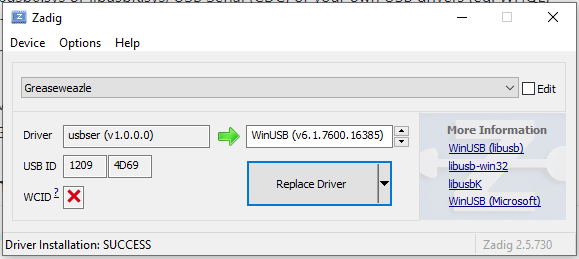

Using the FluxEngine client software with GreaseWeazle hardware
===============================================================

The FluxEngine isn't the only project which does this; another one is the
[GreaseWeazle](https://github.com/keirf/Greaseweazle/wiki), a Blue Pill based
completely open source solution. This requires more work to set up (or you can
buy a prebuilt GreaseWeazle board), but provides completely open source
hardware which doesn't require the use of the Cypress Windows-based tools that
the FluxEngine does. Luckily, the FluxEngine software supports it
out-of-the-box --- just plug it in and nearly everything should work.

I am aware that having _software_ called FluxEngine and _hardware_ called
FluxEngine makes things complicated when you're not using the FluxEngine client
software with a FluxEngine board, but I'm afraid it's too late to change that
now. Sorry.

If you're using Windows
-----------------------

In order to access the GreaseWeazle from Windows, you need to install a WinUSB
driver for it. You can do this with the [Zadig](https://zadig.akeo.ie/)
program. Download it, plug in the GreaseWeazle, and run it; select Options,
List All Devices, and then open the big dropdown box and select the
GreaseWeazle. You should see something like this.

</a>

Ensure that the Driver boxes say `usbser` and `WinUSB`. Then press 'Replace
Driver'. Once done, the GreaseWeazle will be visible to the FluxEngine client.

**Important note!** Unfortunately, now, the original GreaseWeazle client won't
work --- you can't use both drivers at once. I'm working on this. To switch
back to the original driver, for using the GreaseWeazle client software
instead, open up Zadig again, go through the same process, but make sure the left Driver box says `WinUSB` and the right one says `USB Serial (CDC)`. Now, when you press 'Replace Driver' the original driver will be restored.

What works
----------

Supported features with the GreaseWeazle include:

  - simple reading and writing of disks, seeking etc
  - erasing disks
  - determining disk rotation speed

What doesn't work
-----------------

(I'm still working on this. If you have an urgent need for anything, please
[file an issue](https://github.com/davidgiven/fluxengine/issues/new) and I'll
see what I can do.)

  - voltage measurement
  - hard sectored disks (you can still read these, but you can't use
	`--hard-sector-count`).

Who to contact
--------------

I want to make it clear that the FluxEngine code is _not_ supported by the
GreaseWeazle team. If you have any problems, please [contact
me](https://github.com/davidgiven/fluxengine/issues/new) and not them.

In addition, the GreaseWeazle release cycle is not synchronised to the
FluxEngine release cycle, so it's possible you'll have a version of the
GreaseWeazle firmware which is not supported by FluxEngine. Hopefully, it'll
detect this and complain. Again, [file an
issue](https://github.com/davidgiven/fluxengine/issues/new) and I'll look into
it.

