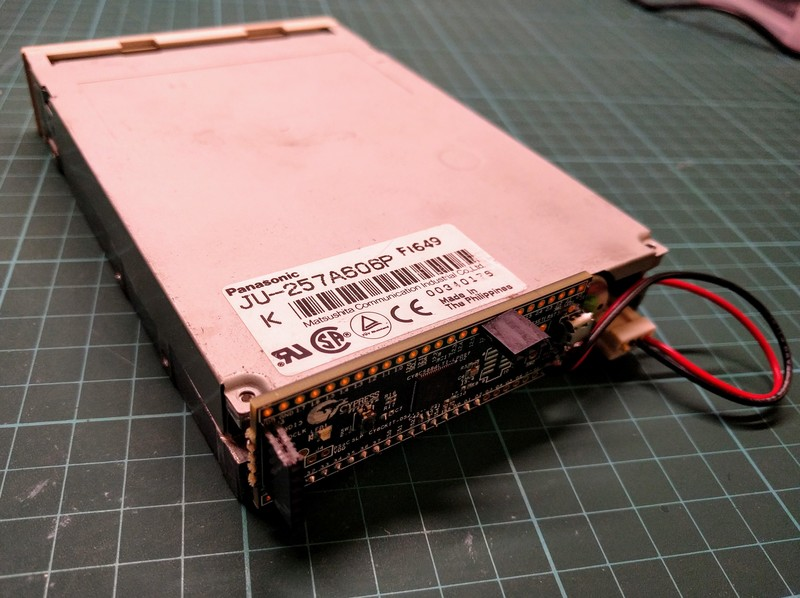
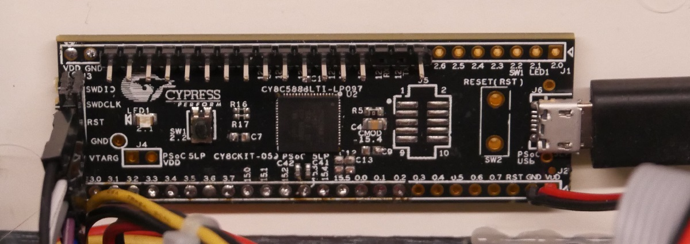

FluxEngine
==========

What?
-----

The FluxEngine is a very cheap USB floppy disk interface capable of reading and
writing exotic non-PC floppy disk formats. It allows you to use a conventional
PC drive to accept Amiga disks, CLV Macintosh disks, bizarre 128-sector CP/M
disks, and other weird and bizarre formats. (Although not all of these are
supported yet. I could really use samples.)



**Important note.** On 2019-02-09 I did a hardware redesign and moved the pins on
the board. Sorry for the inconvenience, but it means you don't have to modify
the board any more to make it work. If you built the hardware prior to then,
you'll need to adjust it.

### Infrequently asked questions because nobody's got round to asking them yet

**Q.** Why not just use a USB floppy drive? There are lots and they're cheap.

**A.** Because USB floppy drives typically support a very limited set of
formats --- typically only IBM 1440kB and 720kB. The FluxEngine should work
on (almost) anything.

**Q.** But aren't floppy disks obsolete?

**A.** Absolutely they are. That doesn't mean they've gone away. Good luck
with any old hardware, for example; a classic Mac won't boot without a
classic Mac boot disk, and you can't make them on PCs (because they're
weird). This is where the FluxEngine comes in.

**Q.** But how can you read and write non-PC formats on a PC floppy drive?

**A.** Because the FluxEngine hardware simply streams the raw magnetic flux
pulsetrain from the drive to the PC, and then the analysis is done off-line
in software. It doesn't rely on any floppy disk controller to interpret the
pulsetrain, so we can be a lot cleverer. In fact, the disk doesn't even have
to be spinning at the same speed.

**Q.** Does it work on 5.25" drives?

**A.** Yes! Although PC 5.25" drives spin at 360 RPM rather than 300 RPM,
which means there's only 166ms of data on one per track rather than 200ms;
if you try to write a 3.5" format disk onto one it probably won't work.

**Q.** Is this like KryoFlux? Do you support KryoFlux stream files?

**A.** It's very like KryoFlux, although much simpler. Yes, FluxEngine can
read from KryoFlux stream files (but not write to them yet; nobody's asked).
FluxEngine doesn't capture all the data that KryoFlux does, like index
markers.

**Q.** That's awesome! What formats does it support?

**A.** I'm glad you asked the question. Consult the following table!

### Formats that it supports

Here's the table.

| Format                            | Read? | Write? | Notes |
|:----------------------------------|:-----:|:------:|-------|
| IBM PC compatible                 |	 🦄   |        | and compatibles (like the Atari ST) |
| [Acorn ADFS](acornadfs.html)      |  🦖   |        | single- and double- sided           |
| [Acorn DFS](acorndfs.html)        |  🦄   |        |                                     |
| [Commodore Amiga](amiga.html)     |  🦖   |        |                                     |
| [Commodore 64 1451](c64.html)     |  🦖   |        | and probably the other GCR formats  |
| [Brother 120kB](brother.html)     |  🦄   |        |                                     |
| [Brother 240kB](brother.html)     |  🦄   |   🦄   |                                     |
| [Macintosh 800kB](macintosh.html) |  🦖   |        | and probably the 400kB too          |
{: .datatable }

Dinosaurs (🦖) have yet to be observed in real life --- I've written the
decoder based on Kryoflux (or other) dumps I've found. I don't (yet) have
real, physical disks in my hand to test the capture process.

Unicorns (🦄) are completely real --- this means that I've read actual,
physical disks with these formats and so know they work.

Notes:

  - IBM PC disks are the lowest-common-denominator standard. A number of other
    systems use this format in disguise (the Atari ST, late-era Apple
    machines, Acorn). FluxEngine supports both FM and MFM disks, although you
    have to tell it which one. If you have an unknown disk, try this; you may
    get something. Then [tell me about
    it](https://github.com/davidgiven/fluxengine/issues/new).

  - Not many formats support writing yet. That's because I need actual,
    physical hardware to test with in order to verify it works, and I only
    have a limited selection. (Plus a lot of the write code needs work.)
    There hasn't been a lot of demand for this yet; if you have a pressing
    need to write weird disks, [please
    ask](https://github.com/davidgiven/fluxengine/issues/new). I haven't
    implement write support for PC disks because they're boring and I'm lazy,
    and also because they vary so much that figuring out how to specify them
    is hard.

If you have samples of weird disks, and want to send them to me --- either
FluxEngine or Kryoflux dumps, or (even better) actually physically --- I can
identify them and add support.

Please note that at this point I am *not interested in copy protected disks*.
It's not out of principle. It's just they'll drive me insane. FluxEngine will
most likely be able to read the data fine, unless they're doing bizarre
things like spiral tracks or partially encoded data, but let's stick with
normal conventionally formatted disks for the time being!

### Big list of stuff to work on

Both the firmware and the software are works in progress. There's still things
to do.

  - Support for more floppy disk formats! I'm trying to scare up some sample
	disks to image and decode; I'm particularly looking for Commodore 64 1541
	disks and Apple Macintosh 800kB CLV disks. If you have any which I can
	borrow and you live in (or near) Switzerland, please [get in
	touch](https://github.com/davidgiven/fluxengine/issues/new).

  - Better (and more) write support. The hardware can write disks, but not much
	of the software's done.  Writing is hard because I really need the device
	to test the disks on. I could use some help here. Also, most of the write
	code is a bit of a disaster and needs a major refactoring.

  - Sourcing a different microcontroller. The PSoC5 is a great thing to work
	with, but it's disappointingly proprietary and the toolchain only works on
	Windows. It'd be nice to support something easier to work with. I need a 5V
	microcontroller (which unfortunately rules out Arduinos) with at least
	seventeen GPIO pins in a row.  As non-PSoC5 microcontrollers won't have the
	FPGA soft logic, that also means I'd most likely need to bitbang the floppy
	drive, so speed is important. If you have any recommendations, please [get
	in touch](https://github.com/davidgiven/fluxengine/issues/new).

Where?
------

It's [open source on GitHub!](https://github.com/davidgiven/fluxengine)

How?
----

### Introduction

The system is based around a [Cypress PSoC5LP CY8CKIT-059 development
board](http://www.cypress.com/documentation/development-kitsboards/cy8ckit-059-psoc-5lp-prototyping-kit-onboard-programmer-and),
which is a decently fast ARM core wrapped around a CLDC/FPGA soft logic
device. You can [get one for about
$15](https://www.mouser.com/ProductDetail/Cypress-Semiconductor/CY8CKIT-059?qs=sGAEpiMZZMuo%252bmZx5g6tFKhundMNZurhvz2tw2jO%2fk8%3d).

You need no extra components --- my old prototype (pictured above) had a
17-way header soldered to one side of the board; it then pushed directly onto
the floppy drive connector. Then you plug it into your PC via USB and you're
ready to go. My newer prototype has a row of pins so I can plug it into a
floppy disk drive cable, because that lets me fit it into a properly floppy
disk drive enclosure. What you do is up to you.

### Bill of materials

So you've decide to go against my advice and attempt to build on of these
suckers. Well, good luck, that's all I can say.

Here's the physical stuff you need.

  - one (1) CY8CKIT-059 development board. See above. If your soldering is
    like mine, you may potentially need more, but as _I_ managed to construct
    the thing without frying it, it can't be too hard.

  - one (1) standard PC floppy disk drive. You'll have to search around as
    they're increasingly hard to find. The FluxEngine should work with any
    standard 3.5" or 5.25" drive.

  - some way of connecting the board to your drive. My prototype above uses a
    set of headers to let me attach the board directly on the back of the
    drive; this works fine, but the geometry's kind of awkward as part of the
    board covered the power socket and I had to modify it. (Which is why the
    programmer is hanging off the back.) I'd recommend soldering on pins
    instead, and using a traditional floppy cable. That'd let you attach two
    drives, too (although this is currently unsupported in the firmware;
    if you want this, [get in
    touch](https://github.com/davidgiven/fluxengine/issues/new).

  - decent soldering iron skills and an iron with a fine tip --- the pads on
    the board are very small.

  - a Windows machine to run the Cypress SDK on. (The FluxEngine client
    software itself will run on Linux, Windows, and probably OSX, but you
    have to build the firmware on Windows.)

  - optional: a floppy drive power cable. You can cut this in half, solder
    the raw end to the FluxEngine board, and power the drive off USB --- very
    convenient. This only works for drives which consume less than 500mA.
    _Check the drive before trying_ (5.25" drives need not apply here).
    Otherwise you'll need an actual power supply.

### Assembly instructions



(In the picture above, the connector on the left goes off to the programmer.
Normally that's physically attached to the board but I had to cut it off to
make it fit on the back of a floppy disk drive. Using pins instead means this
isn't necessary, but, well, now it's too late.)

  1. **If you're using a header:** solder your 17-way header to the
     **bottom** of the board, from 2.7 to 1.7 inclusive. (It has to be 
     the bottom because there are components that stick out on the other side
     and the bottom needs to go flush against the drive.)

  2. **If you're using an IDC header plug:** solder it to the **top** of
     the board, notch up, with the _top_ row of pins overhanging the edge
     of the board (so that pin 1 is disconnected). Pin 2 should be in board
     pin 2.7, and pin 34 in baord pin 1.7.

  3. **If you're using bare pins:** solder your 17-way pin header
     to **either side** of the board, from 2.7 to 1.7 inclusive.

  4. Solder two wires to any convenient VDD and GND pins and connect these to
     your floppy disk drive's power supply. If you're powering the floppy
     drive from the board, connect these directly to the floppy drive. The
     board needs to have the same ground as the floppy disk drive or weird
     stuff could happen. Remember to check the polarity.

And you're done!

### Building the firmware

On your Windows machine, [install the Cypress SDK and CY8CKIT-059
BSP](http://www.cypress.com/documentation/development-kitsboards/cy8ckit-059-psoc-5lp-prototyping-kit-onboard-programmer-and).
This is a frustratingly long process and there are a lot of moving parts; you
may need to register. You want the file from the above site marked 'Download
CY8CKIT-059 Kit Setup (Kit Design Files, Creator, Programmer, Documentation,
Examples)'. I'm not linking to it in case the URL changes when they update
it.

Once this is done, I'd strongly recommend working through the initial
tutorial and making the LED on your board flash. The FluxEngine firmware
isn't nearly ready for fire-and-forget use and you'll probably need to tweak
it. (If you do, please [get in
touch](https://github.com/davidgiven/fluxengine/issues/new)).

When you're ready, open the `FluxEngine.cydsn/FluxEngine.cywrk` workspace,
pick 'Program' from the menu, and the firmware should compile and be
programmed onto your board.

**Big warning:** If programming doesn't work and you get a strange dialogue
asking about port acquisition, then this is because the device isn't
responding to the programmer. This is normal but annoying. You should see the
device in the dialogue. Select it and press the 'Port Acquire' button. The
device should reset and an extra item will appear in the dialogue; select
this and press OK.

If acquiring the port doesn't work, resulting in a long delay and a
meaningless error message, you need to reset the programmer. You'll see that
the light on the programmer is pulsing slowly (a breathing pattern). Press
and hold the little button near the light for five seconds until the light
stays solidly on. Now you should be able to acquire the port and proceed
normally.

### Building the client

The client software is where the intelligence, such as it is, is. It's pretty
generic libusb stuff and should build and run on Windows, Linux and probably
OSX as well, although on Windows I've only ever used it with Cygwin. You'll
need the `sqlite3`, `meson` and `ninja` packages (which should be easy to
come by in your distro). Just do `make` and it should build.

If it doesn't build, please [get in
touch](https://github.com/davidgiven/fluxengine/issues/new).

### Using it

So you have client software, programmed the firmware, and the hardware is all
ready. What next?

  1. Attach the FluxEngine to your floppy disk drive. Pin 2.7 (on the right in
     the picture above) is REDWC and connects to pin 2 on the floppy drive.
     Pin 1.7 (on the left in the picture above) is DSKCHG and connects to pin
     34 on the floppy drive. All the other board pins connect in the obvious
     order. Odd pins on the floppy drive are left unconnected. You can push
     the floppy drive connector straight onto the pins, or the FluxEngine
     board straight onto the floppy disk drive, depending on how you're doing
     it.

  2. **Important.** Make sure that no disk you care about is in the drive.
	 (Because if your wiring is wrong and a disk is inserted, you'll
	 probably corrupt it.)

  3. Connect the floppy drive to power. Nothing should happen. If anything
     does, disconnect it and check step 1.

  4. Connect the FluxEngine to your PC via USB --- using the little socket on
     the board, not the big programmer plug.

  5. Do `.obj/fe-rpm` from the shell. The motor should work and it'll tell you
     that the disk is spinning at about 300 rpm. If it doesn't, please [get
     in touch](https://github.com/davidgiven/fluxengine/issues/new).

  6. Insert a standard PC formatted floppy disk into the drive (probably a good
     idea to remove the old disk first). Then do `.obj/fe-readibm`. It should
     read the disk, emitting copious diagnostics, and spit out an `ibm.img`
     file containing the decoded disk image (either 1440kB or 720kB depending).

  7. Success!

### The programs

#### Source and destination specifiers

When reading from or writing to _a disk_ (or a file pretending to be a disk),
use the `-s` and `-d` options to tell FluxEngine which bits of the disk you
want to access. These use a common syntax:

```
fe-readibm -s fakedisk.flux:t=0-79:s=0
```

  - To access a real disk, leave out the filename (so `:t=0-79:s=0`).

  - To access only some tracks, use the `t=` modifier. To access only some
    sides, use the `s=` modifier.

  - Inside a modifier, you can use a comma separated list of ranges. So
    `:t=0-3` and `:t=0,1,2,3` are equivalent.

  - When specifying a range, you can also specify the step. For example,
    `:t=0-79x2` would be used when accessing a 40-track disk with double
    stepping.

  - To read from a set of KryoFlux stream files, specify the path to the
    directory containing the files _with a trailing slash_; so
    `some/files/:t=0-10`.

Source and destination specifiers work entirely in *physical units*.
FluxEngine is intended to be connected to an 80 (or 82) track double sided
drive, and these are the units used. If the format you're trying to access
lays out its tracks differently, then you'll need a specifier which tells
FluxEngine how to find those tracks. See the 40-track disk example above.

If you _don't_ specify a modifier, you'll get the default, which should be
sensible for the command you're using.

**Important note:** FluxEngine _always_ uses zero-based units (even if the
*disk format says otherwise).

### The commands

The FluxEngine client software is a largely undocumented set of small tools.
You'll have to play with them. They all support `--help`. They're not
installed anywhere and after building you'll find them in the `.obj`
directory.

  - `fe-erase`: wipes (all or part of) a disk --- erases it without writing
    a pulsetrain.

  - `fe-inspect`: dumps the raw pulsetrain / bitstream to stdout. Mainly useful
    for debugging.

  - `fe-readadfs`: reads various formats of Acorn ADFS disks.

  - `fe-readdfs`: reads various formats of Acorn DFS disks.

  - `fe-readbrother`: reads 240kB Brother word processor disks. Emits a
	256-byte-sector FAT filesystem. (You can access this with mtools
	although you'll [to edit them first](brother.html).

  - `fe-writebrother`: writes 240kB Brother word processor disks.

  - `fe-writeflux`: writes raw flux files. This is much less useful than you
    might think: you can't necessarily copy flux files read from a disk,
    because errors in the sampling are compounded and the result probably
    isn't readable. It's mainly useful for flux files synthesised by the
    other `fe-write*` commands.

  - `fe-writetestpattern`: writes regular pulses (at a configurable interval)
    to the disk. Useful for testing drive jitter, erasing disks in a more
    secure fashion, or simply debugging. Goes well with `fe-inspect`.

  - `fe-readibm`: reads 720kB or 1440kB IBM MFM disks. Emits a standard
    filesystem image.

  - `fe-rpm`: measures the RPM of the drive (requires a disk in the drive).
    Mainly useful for testing.

  - `fe-seek`: moves the head. Mainly useful for finding out whether your drive
    can seek to track 82. (Mine can't.)

  - `fe-testbulktransport`: measures your USB throughput. You need about 600kB/s
    for FluxEngine to work. You don't need a disk in the drive for this one.

Commands which take `--source` or `--dest` take a parameter of the syntax
`$FILENAME:$MODIFIER:$MODIFER...` A blank filename refers to the physical
disk; otherwise, you can specify a `.flux` file. The colon-separated
modifiers limit which bits of the disk are accessed. To specify tracks, do
`:t=0-9` (or just `:t=7`). For sides, do `:s=0-1` (or commonly just `:s=0`).
If you have two drives, do `:d=1` (but bear in mind that you need to specify
exactly one drive; ranges won't work). If left unspecified, you get the
default specified by the command, which will vary depending on which disk
format you're using (and is usually the right one).

### How it works

It's very very simple. The firmware measures the time between flux transition
pulses, encodes them, and streams them over USB to the PC.

There's an 8-bit counter attached to an 12MHz clock. This is used to measure
the interval between pulses. If the timer overflows, we pretend it's a pulse
(this very rarely happens in real life).

An HD floppy has a nominal clock of 500kHz, so we use a sample clock of 12MHz
(every 83ns). This means that our 500kHz pulses will have an interval of 24
(and a DD disk with a 250kHz nominal clock has an interval of 48). This gives
us more than enough resolution. If no pulse comes in, then we sample on
rollover at 21us.

(The clock needs to be absolutely rock solid or we get jitter which makes the
data difficult to analyse, so 12 was chosen to be derivable from the
ultra-accurate USB clock.)

Once at the PC, we do some dubious heuristics to determine the clock rate,
which depends on what kind of encoding is being used, and that in turn lets
us decode the pulsetrain into actual bits and derive the raw floppy disk
records from there. Reassembling the image and doing stuff like CRC checking
is straightforward.

Some useful and/or interesting numbers:

  - nominal rotation speed is 300 rpm, or 5Hz. The period is 200ms.
  - a pulse is 150ns to 800ns long.
  - a 12MHz tick is 83ns.
  - MFM HD encoding uses a clock of 500kHz. This makes each recording cell 2us,
    or 24 ticks. For DD it's 4us and 48 ticks.
  - a short transition is one cell (2us == 24 ticks). A medium is a cell and
    a half (3us == 36 ticks). A long is two cells (4us == 48 ticks). Double
    that for DD.
  - pulses are detected with +/- 350ns error for HD and 700ns for DD. That's
    4 ticks and 8 ticks. That seems to be about what we're seeing.
  - in real life, start going astray after about 128 ticks == 10us. If you
    don't write anything, you read back random noise.
  
Useful links:

  - [The floppy disk user's
    guide](http://www.hermannseib.com/documents/floppy.pdf): an incredibly
    useful compendium of somewhat old floppy disk information --- which is
    fine, because floppy disks are somewhat old.

  - [The TEAC FD-05HF-8830 data
    sheet](https://hxc2001.com/download/datasheet/floppy/thirdparty/Teac/TEAC%20FD-05HF-8830.pdf):
    the technical data sheet for a representative drive. Lots of useful
    timing numbers here.

  - [KryoFlux stream file
    documentation](https://www.kryoflux.com/download/kryoflux_stream_protocol_rev1.1.pdf):
    the format of KryoFlux stream files (partially supported by FluxEngine)

Who?
----

The FluxEngine was designed, built and written by me, David Given. You may
contact me at dg@cowlark.com, or visit my website at http://www.cowlark.com.
There may or may not be anything interesting there.

License
-------

Everything here is licensed under the MIT open source license. Please see
[COPYING](COPYING) for the full text. The tl;dr is: you can do what you like
with it provided you don't claim you wrote it.
